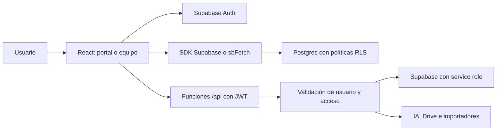
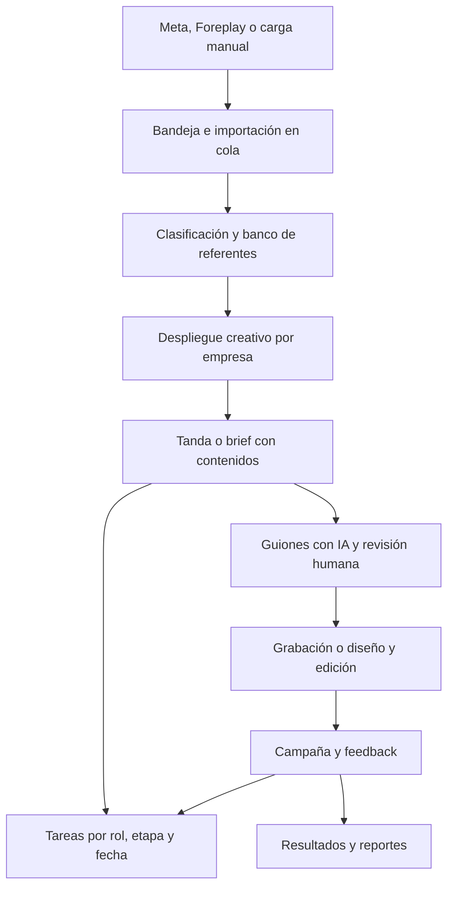

# Mapa de Inforce App

Actualización del 21 de septiembre: esta copia se migró posteriormente a PostgreSQL y un backend local, sobre el código `2b250a5`. La arquitectura desplegada, autenticación y operación están documentadas en [deploy/vps/README.md](deploy/vps/README.md). El análisis siguiente describe la arquitectura original.

Análisis del checkout `27d91c5`, realizado el 17 de septiembre de 2026. Basado en documentación, rutas, capas de datos, lógica de negocio, endpoints, SQL y pruebas locales. No se consultó la base de producción ni se probaron recorridos con cuentas reales. Esto es un mapa técnico y funcional, no una auditoría exhaustiva de seguridad ni una certificación de cada pantalla.

## Qué producto es

Inforce es el sistema de operación de una consultoría de publicidad digital, con un espacio por empresa cliente. Combina estrategia creativa, investigación de anuncios, generación de guiones, coordinación de producción y análisis de resultados. También contiene herramientas internas de tareas, seguimiento, tiempo, finanzas y documentación.

Hay dos áreas principales y varias entradas públicas:

| Área | Entrada | Implementación |
|---|---|---|
| Portal de cliente | `/cliente/<slug>` | `src/App.jsx` y `src/workspace/` |
| Operación interna | `/equipo` | `src/team/TeamApp.jsx` |
| Administración heredada | `/admin` | `src/App.jsx` |
| Registro y acceso | `/signup`, `/login`, `/onboarding` | `src/landing/` |
| Hoja de rodaje compartida | `/brief/<token>` | `src/team/pipeline/BriefPublicPage.jsx` y `api/brief-share.js` |

El código configura `portal.inforceconsulting.com` como dominio canónico y traslada sesiones desde `portal.josehuila.com`. El README todavía menciona el anterior. El plan de implementación conserva un origen separado: `plan.josehuila.com`. Son valores del código, no comprobaciones del despliegue actual.

## Arquitectura y recorrido de una solicitud

React 19 y Vite 8 implementan el navegador. El proyecto usa JavaScript, sin TypeScript. Supabase aporta Postgres, Auth, Storage y Realtime. Las funciones de `api/` se ejecutan en Vercel; en desarrollo las sirve el plugin propio `devApi.js`.

`src/main.jsx` normaliza enlaces antiguos, aplica la migración de dominio y monta proveedores de tema, privacidad visual, onboarding y widgets globales. Un router propio (`src/lib/router.jsx`) divide las zonas por pathname. `App.jsx` concentra autenticación, reportes, selección de empresa y buena parte del portal; `TeamApp.jsx` monta las herramientas internas.

No todas las solicitudes pasan por una API propia. Muchas lecturas y escrituras van directamente del navegador a Supabase, donde RLS debe autorizar cada fila. Las operaciones privilegiadas y las integraciones pasan por `api/`. Los hooks administran estado local, actualizaciones optimistas y suscripciones Realtime; las capas `db.js` traducen los datos para las pantallas.

La interfaz utiliza tokens de diseño, CSS y estilos inline. Recharts dibuja gráficos; TipTap edita texto; dnd-kit implementa arrastre; otras librerías cubren zoom, documentos y exportaciones. Hay carga diferida de módulos, pero la entrada principal y TeamApp siguen siendo grandes.

## Flujo principal del negocio

1. **Bandeja y banco.** Se importan anuncios, se respaldan recursos y se clasifican referentes. El banco organiza conceptos, variaciones y etiquetas. La cola persistida de importación permite seguimiento, reintentos y cancelación; el worker tiene autenticación propia. Archivos centrales: `src/team/inbox/`, `src/team/concept_bank/`, `api/import-jobs.js`, `api/classify-ad.js`.
2. **Despliegue creativo.** Cada empresa tiene tableros con conceptos, variaciones, referencias y creativos producidos. Hay distinción entre publicidad y orgánico. Cadencia y simulador convierten presupuestos y objetivos en necesidades de producción. En la cadencia, primero se calcula el tope, luego el porcentaje de producción y después el reparto TOFU/MOFU/BOFU. Archivos: `src/despliegue/db.js`, `cadencia.js`, `scaling_simulator/`.
3. **Content Pipeline.** El recorrido actual es `idea → scripting → film → edit → campaign → feedback`. Una tanda agrupa contenidos individuales con producto, ángulo, concepto, guion, referentes, fechas, carpetas y métricas. Un estático omite grabación y su edición corresponde a diseño. Archivos: `src/team/pipeline/ContentPipelinePage.jsx`, `pipelineConstants.js`, `data/usePipeline.js`, `data/pipelineDb.js`.
4. **Guionista.** Primero prepara o recupera una estructura del referente; luego genera el guion usando el contexto de la empresa. El flujo separa el texto original de la segunda fase y permite cinco hooks para un mismo cuerpo y CTA. Usa productos, conocimiento, voz y sofisticación del mercado; puede extraer patrones de las correcciones humanas. Archivos: `data/scriptAI.js`, `api/generate-slot-script.js`, `api/_lib/companyContext.js`, `api/_lib/scriptChecks.js`.
5. **Tareas.** Conviven tareas internas (`tasks`) y de cliente (`company_tasks`). El pipeline sincroniza grupos de trabajo por tanda, etapa, fecha y, cuando cambia el oficio, tipo de contenido. Usa `auto_key` para reconciliar tareas y asignados. Guion corresponde a copywriter, coordinación de grabación al PM, video al editor, estático al diseñador y publicación/feedback al trafficker. Esta sincronización se dispara desde el frontend; no debe suponerse que toda escritura externa al pipeline la ejecuta. Fuente: `src/team/pipeline/data/pipelineTasks.js`.
6. **Reportes.** Importación de CSV, métricas, comparación de períodos, correspondencia de anuncios y asistencia de IA. La lógica de diagnóstico distingue falta de datos, falta de umbral y problemas detectados; examina el recorrido de conversión antes de atribuir el problema a fatiga. Archivos: `src/App.jsx`, `src/lib/reportes/`, `src/lib/reports/`.
7. **Plan.** Carga un JSON externo con acciones y conserva progreso, subtareas y metas en Supabase. El contenido estratégico no reside íntegramente en este repositorio. Fuente: `src/workspace/plan_data.js`.

## Herramientas complementarias

| Módulo | Responsabilidad |
|---|---|
| Empresas y equipos | Alta de empresas, archivo, colaboradores, roles y credenciales |
| War Room y Master Tracking | Visión operativa del equipo, seguimiento de cuentas y entregas |
| North Star y Scorecard | Objetivos y mediciones periódicas |
| Tiempo | Temporizadores, registros y estadísticas de trabajo |
| Finanzas | Cuentas, cuaderno, ingresos, gastos, presupuesto, deudas, clientes, suscripciones y asesor IA |
| Manuales | SOPs y material de operación interna |
| Onboarding | Registro, configuración inicial, tours y tutoriales |
| Feedback y notificaciones | Reportes de usuarios y avisos dentro de la app |
| Control de creativos | Seguimiento tabular de producción y entregas |

`ESTADO.md` describe adopción al 22 de agosto de 2026 y marca finanzas y otros módulos como poco usados. Eso es información histórica: su código existe, y no se verificó su uso actual. El registro crea un trial de 14 días; la documentación indica que el cobro no está conectado.

## Modelo de datos

`companies` es la raíz del espacio de cada cliente. Su ID es texto; otras entidades usan UUID. No se pueden intercambiar estos tipos por intuición.

| Familia | Entidades principales |
|---|---|
| Identidad | `auth.users`, `team_members`, `client_users`, `company_team_members` |
| Empresa | `companies`, `reports`, `company_voice_profile` |
| Creativos | `despliegue_boards`, `despliegue_concepts`, `despliegue_variations` |
| Producción actual | `pipeline_briefs`, `pipeline_slots`, `pipeline_share_links` |
| Trabajo cliente | `company_tasks`, `company_task_assignees`, espacios y actividad |
| Trabajo interno | `tasks`, `task_assignees`, `spaces` |
| IA e importación | `company_token_usage`, `import_jobs`, `import_job_ads`, guiones y conocimiento |
| Otros | Familias de plan, finanzas, tracking, onboarding y notificaciones |

Conviven generaciones distintas de producción: `content_items`, slots de despliegue y `pipeline_slots`. Compartir nombres parecidos no los hace equivalentes. Antes de editar una pantalla hay que seguir su importación desde la ruta activa y comprobar qué tablas modifica.

El checkout contiene 521 archivos en `src/`, 23 endpoints de primer nivel en `api/` y 113 archivos SQL en `db/`. Estos últimos no equivalen a 113 migraciones aplicadas: no hay un registro automatizado que permita conocer el esquema real desde el repositorio.

## Autenticación, credenciales y tokens

El login actual utiliza Supabase Auth con correo/contraseña o Google OAuth. El nombre `PinScreen` y varios comentarios de PIN son heredados; no describen por sí solos el mecanismo actual.

1. Supabase autentica al usuario y entrega sesión.
2. El SDK persiste la sesión en localStorage con la clave `inforce-team-auth` y renueva tokens automáticamente. `ensureFreshSession()` existe para las escrituras que lo utilizan; no es un middleware universal.
3. `resolveUserAccess()` distingue operación interna de acceso a empresas. Reúne relaciones de propietario, `client_users` y colaboradores; existen rutas de compatibilidad por correo.
4. Las llamadas directas a Supabase transportan el JWT y se someten a RLS. `buildApiHeaders()` añade `Authorization: Bearer ...` a las APIs propias.
5. `api/_lib/auth.js` valida el JWT con `auth.getUser(jwt)` y comprueba pertenencia interna o acceso a empresa. El cliente servidor utiliza `SUPABASE_SERVICE_KEY`, que omite RLS: cada endpoint debe validar su ámbito explícitamente.

El equipo interno tiene `admin`, `member` y `editor`; el acceso global del resolver de frontend se limita a `admin` y `member` activos. Los colaboradores del cliente pueden combinar `owner`, `project_manager`, `copywriter`, `content`, `editor`, `designer` y `trafficker`. Ver una sección y poder editar sus campos son decisiones distintas. Fuentes: `src/workspace/member_access.js`, `src/workspace/permissions/slot_permissions.js` y `src/team/lib/permissions.js`.

Las claves `VITE_*` llegan al navegador. La clave pública de Supabase está incluida como fallback; no sustituye la autorización. Las claves de proveedores y service role se leen en servidor. Las contraseñas se entregan a Supabase Auth; el endpoint de alta puede generar una contraseña y devolverla una vez a quien administra el acceso, sin guardar una copia recuperable en las tablas de la aplicación.

Hay otros tres mecanismos que deben distinguirse del JWT:

- **Links de brief:** un token da acceso público a una selección de contenidos. El endpoint limita los campos, permite revocación y bloquea briefs en papelera. No requiere login para leer.
- **Google Drive:** el servidor conserva las credenciales OAuth persistentes; un endpoint entrega un access token al navegador del equipo para subir archivos directamente.
- **Worker de importación:** usa `IMPORT_WORKER_SECRET`, comparado con `timingSafeEqual`, para ejecutar trabajo sin sesión de usuario.

La migración entre dominios transporta temporalmente un refresh token en el fragmento de URL, lo retira de la barra y lo canjea con Supabase. Este mecanismo merece conservarse explícito en cualquier revisión de autenticación.

Los tokens de consumo de IA son una métrica diferente: el guionista aplica ventanas de 60.000/hora, 150.000/día y 300.000/semana por empresa, con excepciones para administradores/revisores. Si falla la consulta de consumo, el control permite continuar. Los endpoints genéricos de IA y transcripción no aplican ese mismo control por empresa.

## Hallazgos que afectan el mantenimiento

1. **Entorno local conectado a producción por defecto.** Confirmado en `src/lib/supabase.js`. Una sesión real puede escribir datos reales. No se hicieron esas pruebas.
2. **Permisos divergentes.** El frontend restringe acceso global a `admin/member`, pero `requireCompanyAccess()` da paso global a cualquier miembro interno activo, incluidos editores. Además, el frontend admite ciertas coincidencias por correo que `isTeamMember()` del backend no contempla. Son diferencias de código; su impacto depende del endpoint y de los usuarios existentes.
3. **SQL con definiciones incompatibles.** `google_login_email_match.sql` y `roles_reales.sql` redefinen `is_team_admin()` con criterios distintos. Aplicarlos en distinto orden cambia el resultado. El esquema desplegado debe inspeccionarse antes de afirmar qué política está vigente.
4. **La regla de papelera no cubre todo.** Aunque `DECISIONES.md` exige borrado reversible y sin purga automática, `src/lib/db.js` conserva DELETE real de empresas/reportes, y las capas de tareas internas y de cliente purgan registros con más de 30 días. La UI llama a esas rutas. Es una contradicción concreta que conviene resolver.
5. **Errores que parecen éxito.** `sbFetch()` devuelve `null` en errores HTTP; varios guardados no propagan ese resultado. Sus callers usan `.catch()`, que no captura un error convertido a `null`. Esto puede dejar la vista optimista sin confirmación real de persistencia.
6. **Fallback de pipeline demasiado amplio.** `usePipeline()` activa datos demo ante un fallo de carga; no comprueba exclusivamente que falten tablas. Un error de permisos o conexión también puede producir ese comportamiento.
7. **Acoplamiento y documentación antigua.** `App.jsx` tiene 8.618 líneas. Conviven módulos heredados y actuales, comentarios obsoletos y cifras históricas. La documentación orienta, pero el camino activo debe confirmarse en código.
8. **Cobertura centrada en lógica pura.** Vitest usa entorno Node. Las pruebas ayudan con reglas y transformaciones, pero no prueban recorridos completos de navegador, políticas desplegadas ni servicios externos.

## Verificación local

Se instalaron dependencias con `npm ci --ignore-scripts --no-audit --no-fund`, respetando el lockfile. Se ejecutaron las pruebas y la compilación sin cargar credenciales de servidor ni abrir sesiones reales.

- `npm test`: 44 archivos y 547 pruebas aprobadas.
- `npm run build`: aprobado; advierte de chunks mayores de 500 kB y tiempos de plugins. TeamApp genera aproximadamente 746 kB minificados y la entrada principal 500 kB.
- `npm run lint`: termina correctamente, con 0 errores y 478 advertencias existentes. Incluyen variables sin usar, bloques vacíos y advertencias de hooks; pasar lint no significa que esas observaciones estén resueltas.

No se modificó código funcional ni se desplegó la aplicación. El único archivo de análisis añadido es este documento; `node_modules/` y `dist/` son resultados locales ignorados por Git.

## Cómo orientar el próximo cambio

Para producción creativa, empezar en `src/team/pipeline/`, incluso si el cambio se ve en el portal del cliente. Para estrategia y referentes, seguir `src/despliegue/`, `src/team/concept_bank/` y `src/team/inbox/`. Para acceso, revisar juntos frontend, endpoints y SQL. Para reportes, seguir `App.jsx` y las funciones de `src/lib/reportes/`. Para tareas, distinguir primero si son internas o de una empresa.

Antes de ampliar funcionalidades, las prioridades técnicas que se desprenden de esta lectura son alinear permisos, separar pruebas de producción, resolver la política de borrado y hacer explícitos los fallos de persistencia. Después puede extraerse gradualmente lógica de `App.jsx` sin reescribir todo el producto.
