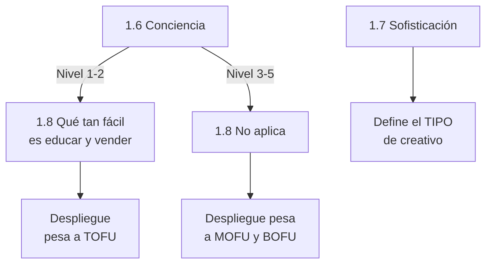
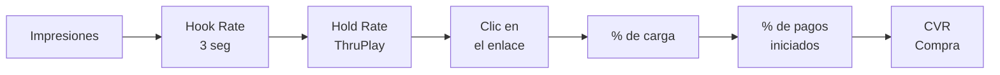

# Estándar Inforce · Marcas

2026-09-19 · @Someone

## Para qué sirve

Este estándar define qué tiene una marca que llega a su objetivo de facturación, en criterios que se pueden calificar sin discutir. Es la pieza madre del service delivery: de aquí salen las preguntas de las tres llamadas de onboarding, los campos del perfil del cliente, la estructura del informe, el plan de acción y el catálogo de contenido pregrabado.

La lógica del onboarding pasa a ser: **esto tiene una marca que llega a donde tú quieres llegar → esto tienes tú → estas son tus brechas, en orden de impacto.**

**Alcance:** solo marcas con producto propio. La versión para dropshippers se construye después.

**Límite:** el estándar cubre solo lo que Inforce toca. Operación, logística y post-venta quedan fuera — no se auditan.

## Los tres niveles

Las dimensiones son siempre las mismas; lo que cambia por nivel es el umbral de cada criterio. **Se audita al cliente contra el nivel de su objetivo, no contra el techo** — así una marca de 40M no recibe cuarenta brechas imposibles.

| Nivel | Facturación mensual (COP) | Lo que se busca en este nivel |
| --- | --- | --- |
| 1 · BASE | 0 – 100M | Dejar de vender por suerte: producto validado, oferta clara, flujo mínimo de creativos, campañas ordenadas |
| 2 · ESCALA | 100M – 500M | Instalar volumen y equipo: el cuello deja de ser la idea y pasa a ser la capacidad de producción |
| 3 · ÉLITE | 500M – 1.000M | Que el sistema corra sin el dueño: marca, márgenes sanos y recompra que sostienen el gasto |

### El nivel no baja la vara: cambia el orden

La vara es siempre la misma. Un 10 es un 10 para todos, y el informe siempre muestra la nota contra el estándar completo — así el cliente ve el techo real y sabe a dónde tiene que llegar, sin que nadie le diga "para lo chiquito que eres, vas bien".

Lo que cambia por nivel es **qué brechas entran al plan primero**. Una marca en BASE con la retención en 3 no tiene que arreglar eso ahora; una en ÉLITE con la retención en 3 está dejando ir su mayor palanca de crecimiento. Misma nota, urgencia distinta.

Eso parte el informe en dos cosas que hoy se confunden: **el diagnóstico completo**, que muestra todo, y **el plan**, que muestra las tres o cuatro cosas que le toca ahora.

| Nivel | Qué entra al plan primero | Qué puede esperar |
| --- | --- | --- |
| **1 · BASE** 0–100M | Producto y oferta (1) · margen (2) · estrategia creativa (3) · volumen y estabilidad de producción (4) · medición y estructura básica de cuenta (5) · lo de CRO que se arregla rápido (6) | Retención (8), orgánico a fondo (7), y sistemas más allá de lo mínimo (9) |
| **2 · ESCALA** 100–500M | La fábrica de contenido completa (4) · equipo y sistemas (9) · estrategia creativa a fondo (3) · la reunión semanal de datos (10) · tráfico completo (5) · orgánico empieza a pesar (7) | Retención más allá del AOV (8) |
| **3 · ÉLITE** 500M–1.000M | Orgánico y marca (7) · retención y recompra (8) · documentación y que corra sin el dueño (9) · datos con responsable propio (10) | Nada: a este nivel todo lo demás ya debería estar |

**Dos cosas van primero en cualquier nivel, sin excepción:** el montaje de medición (5.4) y la salud del margen (2.1). Si la medición miente o el margen no aguanta, todo lo demás se decide sobre arena.

**Y hay una excepción al orden:** cuando una dimensión está en rojo profundo y es la que está frenando todo lo demás, sube al primer lugar sin importar el nivel. Una marca en BASE cuyo dueño no puede producir más de tres creativos al mes tiene un problema de equipo, aunque el equipo "no toque" todavía.

## Cómo se escribe cada dimensión

Cada dimensión es una lista de puntos que se analizan, y cada punto dice cómo se califica. Nada más.

**Las tres formas de calificar:**

| Forma | Para qué sirve |
| --- | --- |
| Sí / No + descripción | Hechos: existe o no existe |
| 1 a 10 + descripción | Calidad: qué tan bien lo están haciendo |
| Solo descripción | Lo que no se califica pero hay que dejar registrado |

Cada punto que se califica de 1 a 10 lleva escrito **qué es un 10 y qué es un 1**, para que José, Nath y Deison califiquen parecido y no sea el gusto de cada uno.

**Cada punto lleva también un ejemplo corto**, escrito en la pantalla del portal junto a la pregunta. Sirve para tres cosas: que quien dicta la llamada lo explique rápido, que se pueda delegar a alguien que no es José, y que el cliente entienda solo lo que está leyendo.

La descripción es el campo clave: es lo que le da sentido a la nota, es lo que el cliente lee en el informe, y es lo que después una IA puede llenar sola leyendo el transcript de la llamada.

**El nivel define qué nota alcanza.** Un 6 puede ser suficiente en BASE y ser una brecha en ÉLITE. El corte por nivel se define dimensión por dimensión, no por regla general.

Cada dimensión cierra con dos campos más: **qué evidencia se pide** (captura, acceso, link — nunca la palabra del cliente) y **qué entrega Inforce cuando sale bajo**. Ese último es el que conecta el estándar con el producto: si una brecha no tiene nada que Inforce entregue, ahí hay un hueco.

## Mapa de las diez dimensiones

| # | Dimensión | Puntos | Audita |
| --- | --- | --- | --- |
| **QUÉ VENDES** |  |  |  |
| 1 | Producto y oferta | 8 | José |
| 2 | Números del negocio | 2 + formulario | José (Deison verifica) |
| **CÓMO LO VENDES** |  |  |  |
| 3 | Estrategia creativa | 11 | José |
| 4 | Producción de contenido | 9 | Nath |
| 5 | Tráfico y estructura de campañas | 14 | Deison |
| 6 | Web y conversión (CRO) | 9 | José |
| 7 | Orgánico y marca | 15 | Nath |
| 8 | Retención y recompra | 11 | José |
| **MOTOR** |  |  |  |
| 9 | Equipo y sistemas | 13 | José |
| 10 | Datos y lectura de resultados | 5 | Deison |

### Dos cortes que definen el mapa

**Estrategia creativa (3) vs. producción de contenido (4).** La 3 audita el plan: si existe un despliegue pensado. La 4 audita la fábrica que lo ejecuta, eslabón por eslabón.

**Las personas se califican una sola vez.** Cada rol se juzga en su dimensión — guionista, grabación y editor en la 4, trafficker en la 5, web en la 6, orgánico en la 7, recompra en la 8 — y la 9 mira la estructura, no a las personas.

**El estándar mide a la empresa, no a Inforce.** Ninguna dimensión se marca bien porque Inforce lo esté haciendo por ellos. El criterio de la 10 no es "Inforce les hace una reunión semanal de datos" sino "la empresa tiene la suya, con un responsable". La llamada semanal de los tres meses es el andamio que enseña a hacerla.

## Dónde se llena el estándar

El estándar no es un documento que alguien transcribe después de las llamadas. Se llena en tres momentos, en este orden:

**1. Formulario previo — lo llena el cliente, obligatorio antes de la llamada.**

Datos duros que no vale la pena preguntar en vivo: precios y ticket, facturación actual y objetivo, roles que hoy tiene el equipo, y los accesos (cuenta publicitaria, web, Drive). Corto y de preguntas cerradas: si se vuelve un cuestionario largo, no lo llenan.

**2. Pantalla de onboarding en el portal — se llena en vivo, en la llamada.**

Cada cliente nuevo tiene su portal dentro de la plataforma, con una sección de onboarding. En la llamada, quien dicta comparte pantalla y van calificando los puntos junto con el cliente, que ve cómo queda y por qué. Cada quien llena lo suyo: José en su llamada, Nath en la suya, Deison en la suya — sobre el mismo perfil, así que el que entra después ya llega con el contexto de los anteriores.

**3. La IA con el transcript — al terminar la llamada.**

Se pasa el transcript de Fathom y la IA llena la descripción de cada punto con lo que se habló. Eso completa el perfil del cliente, y de ahí salen el informe y el plan.

### Por qué esto cambia el onboarding

Hoy las llamadas son preguntas sueltas y el documento se arma después, a mano, y llega días más tarde. Con esto el documento se construye **durante** la llamada y el cliente lo ve armarse. Además, lo que se llena por formulario o mirando la web deja de gastar tiempo de llamada: la llamada se usa para lo que solo se saca conversando.

**Pendiente:** construir la pantalla de onboarding en el portal — va al frente de plataforma, con Daniel Pozo — y diseñar el formulario previo campo por campo.

## El formulario previo, campo por campo

Vive en el portal desde el primer día. El cliente puede agendar sus llamadas apenas entra, pero **el formulario es requisito para entrar a ellas**: va con un aviso grande diciendo que sin llenarlo no se pueden hacer las llamadas de onboarding.

**Regla de todo el formulario: cada campo trae su instrucción.** Dónde ver el dato, en qué pantalla, cómo calcularlo si no lo tiene a la mano. Es lo que evita que el cliente se tranque y deje el formulario a medias, y es lo que hace que se pueda exigir completo.

La casilla **"no lo sé"** existe, pero solo en algunos campos — no en todos. Va después de la instrucción, y solo donde no saber el dato es en sí mismo un hallazgo:

**Llevan casilla:** margen por producto o categoría · CPA de los últimos 30 días · ROAS de los últimos 30 días · tasa de conversión global · porcentaje de carga de la página · porcentaje de recompra y cada cuánto.

**No llevan casilla:** datos de la marca, productos y precios, facturación, ticket promedio, gasto en pauta, formalización, contraentrega vs. anticipado, base de datos de clientes y equipo. Todo eso el cliente lo sabe o lo tiene a una consulta de distancia, y se exige completo.

Si con la instrucción al frente el cliente igual no saca su margen o su CPA, eso no es pereza: califica solo el punto 2.2.

### 1 · La marca

| Campo | Alimenta |
| --- | --- |
| ¿Qué tipo de marca es? Marca propia que resuelve un problema · marca aspiracional (ropa, accesorios, joyería, calzado) · dropshipping | Es la pregunta más importante del formulario: cambia el peso de las dimensiones y esconde los puntos que no aplican. Va de primero |
| Nombre de la marca | Perfil |
| Página web | Dimensión 6 |
| Instagram | Dimensión 7 |
| Nombre, correo y teléfono de cada socio o dueño | Perfil. Se repite el bloque: si son dos dueños, dos; si son tres, tres |

### 2 · Productos

| Campo | Alimenta |
| --- | --- |
| ¿Manejan diferentes categorías de producto? ¿Cuántas? | 1.0 datos de base |
| ¿Cuántos productos venden en total? | 1.0 datos de base |
| Los productos principales (hasta tres) con su precio de venta | 1.0 y dimensión 2 |
| Margen de cada uno de esos productos | 2.1 |
| Si son demasiados productos: categoría, ticket promedio y margen por categoría | 1.0 y 2.1 |

Se pregunta por **margen**, no por costo puesto. El cliente casi siempre sabe su margen; desglosar producto más envío más empaque lo hace dudar y lo deja en blanco.

### 3 · Números del negocio

| Campo | Alimenta |
| --- | --- |
| Facturación del último mes | Dimensión 2 |
| Facturación promedio de los últimos 3 meses | Dimensión 2 |
| Facturación objetivo de aquí a 3 meses | Define el nivel contra el que se audita todo |
| Ticket promedio de la tienda | Dimensión 2 |
| Gasto en pauta de los últimos 30 días | Dimensiones 2 y 5 |
| CPA de los últimos 30 días | 2.1 |
| ROAS de los últimos 30 días | 2.1 |
| ¿Está formalizado / paga IVA? | 2.1 |
| % de ventas contraentrega y % anticipado (suman 100) | 2.1 |

### 4 · Números de la tienda

| Campo | Alimenta |
| --- | --- |
| Tasa de conversión global | 6.1 |
| Porcentaje de carga de la página según los anuncios | 6.2 |

El detalle de visita a checkout y checkout a compra no se pide aquí: alarga el formulario y esa data sale mejor con Deison, en el punto 5.7.

### 5 · Recompra

| Campo | Alimenta |
| --- | --- |
| ¿Qué porcentaje de clientes vuelve a comprar, y en cuánto tiempo? | 8.2 |
| ¿Tiene la base de datos de clientes en un solo lugar y exportable? | 8.3 |

### 6 · Equipo

| Campo | Alimenta |
| --- | --- |
| Nombre de cada persona del equipo y qué hace, incluidos los dueños | 9.1 y 9.2. De aquí salen solos los huecos de rol del 9.4 |

### 7 · Acceso

| Acceso | Cómo se consigue |
| --- | --- |
| Cuenta publicitaria, como lector | Lo gestiona Deison directamente con el cliente, no es un campo del formulario |

No se piden accesos al panel de la tienda, a las carpetas de creativos ni al administrador de eventos. Eso se ve en la llamada: el cliente comparte pantalla y pasa lo que haga falta. Pedirlo por anticipado alarga el formulario y frena el arranque.

**Consecuencia a tener en cuenta:** sin panel de la tienda, la auditoría previa de la dimensión 6 se hace con la web pública desde el celular, y las tasas finas se confirman en la llamada. Y sin carpeta compartida, Nath audita la dimensión 4 con lo publicado en la biblioteca de anuncios.

### Cómo funciona el formulario

**Es requisito para entrar a la llamada, no para agendarla.** El cliente agenda apenas ingresa y se le manda el formulario de inmediato, con un aviso grande de que sin llenarlo no se pueden hacer las llamadas de onboarding.

**Si llega con el formulario a medias, se reagenda.** No se entra igual. Es la única forma de que las llamadas se usen para trabajar y no para preguntar, y protege tanto el tiempo del cliente como el de José.

**El formulario crea la cuenta del portal.** Al final, el cliente deja su correo y define una contraseña, y con eso queda creada su cuenta. Entra y ya ve su perfil con la parte que él mismo llenó y lo que falta por delante. Así nadie tiene que crear cuentas a mano, y el cliente conoce el portal el mismo día que entra.

### El mensaje con que se envía

```
Hola [Nombre], bienvenido a Inforce 🦾

Antes de tus llamadas de onboarding necesito que llenes este formulario:
es la información base de tu marca y es lo que nos permite llegar a las
llamadas ya habiendo estudiado tu caso.

Cada pregunta trae la instrucción de dónde sacar el dato, así que no te
vas a trancar en ninguna.

Ojo: sin el formulario completo nos toca reagendar las llamadas.

Al final creas tu acceso al portal, donde va a vivir todo tu proceso.

[link]
```

**Reparto de las llamadas, ya cerrado:** José audita las dimensiones 1, 2, 3, 6, 8 y 9. Nath audita la 4 y la 7. Deison audita la 5 y la 10, y contrasta los números de la 2 contra la cuenta.

## Dimensión 1 · Producto y oferta

**Audita:** José, en llamada, compartiendo pantalla con el cliente.

**Por qué importa:** todos los productos se venden, pero no en cualquier condición. El mismo producto a un precio se vende sin marca, y a otro precio necesita una marca que el cliente todavía no tiene. Esta dimensión no juzga si el producto es bueno — juzga si encaja con el nivel de marca y el mercado que tiene hoy.

**Todos los puntos llevan descripción.** La nota dice qué tan bien está; la descripción dice por qué — también cuando queda en el intermedio. La IA llena la descripción leyendo el transcript de Fathom.

### Datos de base

Antes de calificar nada, el perfil tiene que tener esto. Sale del formulario previo y queda como base para las demás dimensiones — sobre todo para la 3, donde el contenido se define por producto.

- Cuántos productos vende
- Qué categorías de producto maneja
- Cuál es el producto principal y su precio

### Qué se analiza

| Punto | Califica | Qué es un 10 | Qué es un 1 | Ejemplo (va en la pantalla) |
| --- | --- | --- | --- | --- |
| **1.1** Qué tanta aceptación tiene el mercado por el producto hoy | 1 a 10 + descripción | El mercado lo quiere. Vende bien incluso con anuncios flojos y una marca poco trabajada: se empuja poco y sale | Toca empujar muchísimo por cada venta. Aunque la estrategia esté bien hecha, sacarlo cuesta | Hay marcas con una estrategia maluquísima que igual venden bien: eso dice que hay mucha gente queriendo ese producto sin importar la reputación de la marca. La prueba: quítale mentalmente el mérito a la estrategia y a la marca. Si los anuncios fueran flojos y la marca desconocida, ¿el mercado igual lo compraría? |
| **1.2** Encaje entre el precio y la confianza que proyecta la marca | 1 a 10 + descripción | El producto se compra sin fricción por tema de precio. Con la percepción de marca que ya tiene, incluso podría subirlo | La gente no termina de ver el valor del producto a ese precio. Toca mejorar la percepción de marca y de producto antes de poder sostenerlo | Lummia vende su depiladora IPL en unos 549 mil cuando en Google hay depiladoras láser desde 74 mil. Lo que le permite cobrar eso es la percepción de marca. La prueba: mirar el rango de precios de la competencia y preguntarse si la marca, como se ve hoy, justifica estar donde está |
| **1.3** ¿La oferta está construida o es el producto pelado? | 1 a 10 + descripción | Además del producto, el cliente se lleva garantía, envío claro, y algún bono o combo. Hay una razón para comprar ahora | Es el producto y un precio. Nada más | Dos marcas venden la misma crema a 120 mil. Una ofrece "la crema, 120 mil". La otra ofrece "la crema + la guía de rutina + garantía de 30 días + envío gratis en 48 horas". La prueba: listar en voz alta todo lo que recibe el cliente por su plata. Si la lista tiene un solo ítem, es un 1 |
| **1.4** Diferenciación: por qué comprarle a él | 1 a 10 + descripción | Hay una razón clara, repetible y defendible | Es lo mismo que venden otros veinte | "Somos los únicos con garantía de seis meses y cambio sin preguntas" es un 9. "Somos de buena calidad y buen precio" es un 2. La prueba: si un competidor pudiera copiar la frase tal cual y seguir siendo cierta, no es diferenciación |
| **1.5** ¿Contra qué enemigos compite el producto? | 1 a 10 + la lista de enemigos | Hay dos o tres alternativas claras contra las cuales compararse, y cada una con una debilidad concreta y atacable | No hay contra qué compararlo, o el único enemigo es "no hacer nada" | Los enemigos de la depiladora IPL en casa son el centro de depilación — carísimo, sin privacidad, toca sacar el tiempo e ir hasta allá — y la cuchilla — raspa, no es permanente, toca repetir siempre. La prueba: nombrar contra qué está compitiendo el producto en la cabeza del cliente cuando decide, y qué tiene de malo cada alternativa. Cada enemigo con su debilidad es un ángulo de venta listo para la dimensión 3 |
| **1.6** Tamaño del mercado | 1 a 10 + descripción | Mucha gente en el país podría comprarlo. El techo está lejos | Nicho pequeño: se satura rápido y el techo llega pronto | Mascotas en Colombia es un mercado enorme. Ojo: el tamaño solo no dice nada sin el ticket. Un mercado pequeño con ticket alto — aspiradoras de casa — puede dar más que uno grande con ticket bajo. Grande con ticket alto, como el cepillo de Lummia, es el golazo |
| **1.7** Distribución de conciencia del mercado | Porcentaje aproximado en cada uno de los 5 niveles (suman 100) + descripción | — | — | **No es un nivel único: un mercado tiene varios públicos a la vez.** En la IPL de Lummia hay un público que ya sabe que existe la depilación en casa y otro grande que ni idea. Se reparte a ojo: "40% en nivel 1, 30% en nivel 3, 20% en 4, 10% en 5". No busca precisión, busca saber dónde está el grueso. La escala completa — y sus dos lecturas según si el producto es de necesidad o aspiracional — está abajo |
| **1.8** Nivel de sofisticación del mercado | Nivel 1 a 5 donde está el grueso + descripción | Nivel 1: mercado virgen, basta con decir la promesa | Nivel 5: todos dicen lo mismo, nadie cree nada, solo gana la marca | Mide qué tanto ha oído el MERCADO las promesas de la categoría. También es aproximación, no exactitud. La prueba: mirar diez anuncios de la categoría en la biblioteca — la escala de abajo dice qué nivel es cada patrón |
| **1.9** Qué tan fácil es educar al mercado y venderle *(condicional)* | 1 a 10 + descripción, o No aplica | Con un video entienden el problema, la solución, y se animan a comprar | Lo entienden, pero cuesta muchísimo que se animen a gastar su plata en eso | Solo se llena si una parte grande del mercado está en niveles 1 o 2 de conciencia. Peluna fue fácil. La máscara de luz roja es difícil: no porque la gente sea bruta, sino porque entender qué es la luz roja no la lleva a sacar la tarjeta. La prueba: no es si lo entienden, la gente entiende. Es si después de entenderlo están dispuestos a gastar su plata |
| **1.10** Recorrido creativo del producto | 1 a 10 + descripción | Da para muchos ángulos, públicos, usos y formatos distintos | Solo se puede decir una cosa de él | Una crema facial da para antes y después, testimonios, ingredientes, comparación, rutina, regalo. La prueba: en la llamada se listan los ángulos posibles en voz alta. Si no salen al menos seis distintos entre los dos, el recorrido es corto. Los enemigos del 1.5 y los públicos del 1.7 son la materia prima |
| **1.11** ¿El objetivo de facturación es alcanzable con este producto y este mercado? | Sí / No + descripción | — | — | No se responde a ojo: la pantalla ya tiene los datos. Cruza el objetivo de tres meses del formulario contra el tamaño de mercado (1.6), el ticket, la inversión necesaria de la dimensión 2 y el volumen creativo del 4.3. Es el punto que más vale conversar en voz alta con el cliente al frente |

### Cómo se leen juntos el tamaño, la conciencia y la educación

### Los dos ejes: conciencia y sofisticación

Son dos preguntas distintas y es fácil confundirlas:

- **Conciencia (1.6)** — qué tanto sabe **la persona** sobre su problema y sobre la solución.
- **Sofisticación (1.7)** — qué tanto ha oído **el mercado** las promesas de esta categoría.

Se pueden cruzar de cualquier forma. Alguien puede saber perfectamente que quiere gomitas de vinagre de manzana (conciencia 5) en un mercado donde diez marcas dicen exactamente lo mismo y ya nadie les cree (sofisticación 5). Y al revés: un mercado que no sabe que el problema existe (conciencia 1) suele ser también un mercado virgen en promesas (sofisticación 1).

### Escala de conciencia — punto 1.7

**Dos reglas antes de la escala.**

Primero, **no se escoge un nivel: se reparte el mercado en porcentajes.** Un mercado casi nunca está todo en el mismo escalón. En la depilación IPL hay un público que ya sabe que existe la versión de casa y otro, grande, que ni idea. Se reparte a ojo y se busca dónde está el grueso, no precisión.

Segundo, **la escala se lee distinto según el producto.** "No sabe que tiene el problema" no significa nada para ropa u oro laminado: ahí nadie tiene un problema, tiene un deseo. Por eso hay dos lecturas.

| Nivel | Producto de necesidad (resuelve un problema) | Producto aspiracional (deseo, estética, estatus) | Qué tiene que hacer el anuncio |
| --- | --- | --- | --- |
| 1 | No sabe que tiene el problema | No se le ha ocurrido que podría tener eso | Mostrarle el problema o el deseo. Casi todo TOFU |
| 2 | Sabe que le pasa, no sabe que hay solución | Le gusta la idea, no sabe que es accesible o que existe así | Mostrarle que sí puede tenerlo |
| 3 | Sabe que hay soluciones, no conoce las marcas | Conoce la categoría, no conoce las marcas | Mostrarle que tu producto es esa opción |
| 4 | Conoce marcas y compara | Conoce marcas y compara | Mostrarle por qué tú y no el otro |
| 5 | Ya decidió, solo falta la oferta | Ya la quiere, solo falta la oferta | Darle la oferta y quitar fricción. BOFU puro |

**Para qué sirve el reparto.** Los porcentajes son directamente la mezcla del despliegue. Si el 40% del mercado está en nivel 1, el 40% de la producción tiene que ser TOFU. Deja de ser una discusión de criterio y pasa a ser una cuenta.

### Escala de sofisticación — punto 1.7

Es la escala de Eugene Schwartz, de *Breakthrough Advertising*. Cada nivel obliga a un tipo de creativo distinto, y usar el de un nivel equivocado es la forma más cara de quemar presupuesto.

| Nivel | Estado del mercado | Qué tiene que hacer el creativo | Ejemplo |
| --- | --- | --- | --- |
| 1 | Mercado virgen, nadie ha hecho esa promesa | Decir la promesa directa y simple, y probarla | "Tu perro deja de oler mal" |
| 2 | Ya hay competencia, pero la promesa aún funciona | Agrandar la promesa hasta el límite de lo que se puede sostener | "Tu perro deja de oler mal por 15 días" |
| 3 | Ya oyeron la promesa y no la creen | Introducir un **mecanismo**: explicar el cómo, no el qué | "Las enzimas que neutralizan el olor en vez de taparlo" |
| 4 | Los mecanismos también están saturados | Mejorar el mecanismo: más rápido, más fácil, sin esfuerzo | "Enzimas que actúan en 3 minutos y sin enjuagar" |
| 5 | Nadie cree nada, todo suena igual | Vender por identificación y marca. Ya no es qué vendes sino quién eres | La gente compra porque se reconoce en la marca |

**Cómo se identifica el nivel, rápido:** por cómo habla el cliente y su mercado de la categoría. Nivel 1 o 2 suena a deseo general: "quiero algo que le quite el olor". Nivel 3 a 5 suena a intentos fallidos: "ya probé tres marcas y ninguna sirvió". Entre más escepticismo e historial, más alto el nivel.

**La prueba operativa:** abrir diez anuncios de la categoría en la biblioteca.

- Todos dicen la promesa pelada → nivel 1 o 2
- Todos explican un mecanismo → nivel 3
- Todos compiten en qué mecanismo es mejor, más rápido o más fácil → nivel 4
- Los que ganan casi no hablan del producto, hablan de identidad → nivel 5

**Por qué esto le importa al cliente:** un mercado nivel 4 al que le hablas con creativos de nivel 1 no te va a comprar, por bueno que sea el producto. Y al revés: meterle mecanismo complicado a un mercado virgen es perder el tiempo explicando algo que nadie pidió. El nivel de sofisticación dice qué tipo de creativo hay que hacer, no solo cuánto.

**Y explica el punto 1.4.** Cuando el mercado llega a nivel 5, la diferenciación por producto deja de funcionar y la única defensa es la marca — que es exactamente lo que pasa cuando entran competidores con más presupuesto.

### El árbol de la dimensión



La conciencia define **a quién le hablas y en qué proporción**. La sofisticación define **cómo le hablas**. Las dos juntas son el brief del despliegue creativo, y salen del diagnóstico en vez de salir del instinto.

### Cómo se leen el tamaño, la conciencia y el ticket

| Combinación | Qué significa |
| --- | --- |
| Mercado grande + conciencia alta | El más obvio, y por eso el más peleado. Casi siempre viene con el 1.9 bajo |
| Mercado grande + conciencia baja + fácil de educar | La mina de oro. El que educa primero se queda con el mercado. Peluna |
| Mercado grande + conciencia baja + difícil de educar | Caro y lento. Necesita mucho TOFU y presupuesto para aguantar |
| Mercado chico + ticket alto | Sirve igual: el techo lo pone la facturación posible, no la cantidad de gente |
| Mercado grande + ticket alto | El golazo |
| Mercado chico + ticket bajo | Se satura rápido y el techo llega antes de lo que el cliente cree |

**Consecuencia para el resto del estándar:** el nivel de conciencia decide la mezcla del despliegue creativo. Eso resuelve algo que hasta ahora quedaba a criterio suelto en el punto 5.13 — la mezcla deja de decidirse por instinto y sale del diagnóstico. La dimensión 1 produce el dato que define la mezcla de la dimensión 3.

**Cómo se le explica al cliente:** hay cinco escalones de conciencia — no sabe que tiene el problema, sabe que le pasa pero no que hay solución, sabe que hay soluciones pero no qué marcas, conoce marcas y compara, y ya decidió y solo falta la oferta. El trabajo de los anuncios es mover gente de un escalón al siguiente. Saber en cuál está la mayoría de su mercado es lo que dice qué contenido hay que hacer.

**Requisito para la pantalla del portal:** los puntos condicionales tienen que aparecer y desaparecer solos según la respuesta anterior. Hoy son el 1.7, el 1.8 y el 8.1, que abre o cierra todo el bloque de recompra. Así la llamada no gasta tiempo en preguntas que no aplican y el cliente no ve campos vacíos que parecen deudas.

Si el 1.8 sale en No, el accionable no es pautar más: es ampliar catálogo o buscar otro producto. Es de los hallazgos que más valor le dan al cliente y que hoy nadie le dice.

### Cómo se llena en la llamada

No es un cuestionario. José comparte pantalla, van llenando los puntos juntos y el cliente ve cómo se califica y por qué.

**Tres puntos se califican mirando, sin preguntar:** claridad de la oferta, encaje precio–confianza y diferenciación — se ven en la web y en el Instagram mientras se conversa.

**Lo que sí se conversa:**

- Contáme cómo van tus ventas: cuánto vendes, a qué costo por compra, qué tan estable es → 1.1
- ¿Cuál es tu producto principal y a qué precio lo vendes? → 1.2
- ¿Por qué la gente te compra a ti? ¿Qué tiene la competencia que tú no? → 1.4
- ¿Qué tanta gente está comprando esto? ¿Quién más lo vende con pauta y hace cuánto? → 1.5 y 1.6
- ¿Cuántas formas distintas se te ocurren de vender este producto? → 1.7

### Evidencia

Web y ficha de producto · Instagram · biblioteca de anuncios de la competencia · los números de venta que dé el cliente.

### Qué entrega Inforce cuando sale bajo

Inforce no entrega productos ni mercados. En esta dimensión varios puntos no tienen solución de Inforce, y eso se dice de frente.

| Punto bajo | Qué hace Inforce |
| --- | --- |
| 1.1 El producto cuesta venderlo | No hay entregable. Se dice claro y se recomienda validar antes de meterle plata a pauta |
| 1.2 El precio va por delante de la marca | Sí hay: subir la confianza desde la dimensión 7 (orgánico y marca) y la 6 (CRO), o recomendar bajar el ticket de entrada |
| 1.3 Oferta poco clara | Sí hay: se rearma la oferta y la ficha de producto. Entra al plan |
| 1.4 Sin diferenciación | Sí hay entregable: el trabajo de ángulos de la dimensión 3 la saca o la construye. Y cuando el producto no da para diferenciarse, la diferenciación tiene que venir de marca — ser los más conocidos y los más confiables — y eso se construye desde la dimensión 7. Es además la única defensa real cuando al mercado entren competidores más fuertes: si no hay marca, se comen el mercado |
| 1.5 / 1.6 Mercado chico o muy competido | No se cambia. Se ajusta el objetivo o se recomienda ampliar catálogo |
| 1.8 Objetivo no alcanzable | No hay entregable: es una conversación honesta para reajustar el objetivo o el catálogo |

Que haya puntos sin entregable no es una debilidad de la dimensión: es su función. Sirve para poner expectativas reales desde el día uno, que es justo lo que evita que un cliente llegue al mes tres sintiendo que no funcionó.

**Nota:** la brecha más común aquí no es el producto sino que el precio va por delante de la marca — y esa sí se cierra.

## Dimensión 2 · Números del negocio

**Cerrada** — revisada con José.

**Audita:** nadie. El cliente llena los datos en el formulario y **los dos puntos se califican solos**. José los revisa en la llamada solo si alguno huele raro, y Deison contrasta los números contra la cuenta publicitaria.

**Por qué importa:** los números definen si el negocio aguanta escalar con pauta. Sin margen no hay escala, por buena que sea la estrategia creativa. Y la mayoría de dueños no sabe cuál es su CPA máximo, que es el número del que dependen todas las decisiones de pauta.

### Parte A · Datos que llena el cliente

Todos van en el formulario previo. Son campos de llenar, no de calificar.

| Campo | Por qué se pide |
| --- | --- |
| Facturación del último mes | Punto de partida real |
| Facturación promedio de los últimos 3 meses | Muestra si es estable o fue un pico |
| Facturación objetivo de aquí a 3 meses | Define contra qué nivel se audita todo el estándar |
| Productos principales con su precio de venta | Base de todos los cálculos |
| Margen por producto, o por categoría si son muchos | Es lo que define si aguanta pauta. Se pide el margen directo, no el costo desglosado: el cliente casi siempre lo sabe |
| Ticket promedio de la tienda | Distinto al precio del producto principal si hay combos |
| Gasto en pauta de los últimos 30 días | Para leer CPA y ROAS reales |
| CPA de los últimos 30 días | — |
| ROAS de los últimos 30 días | — |
| ¿Está formalizado / paga IVA? | En nivel 2 y 3, una rentabilidad que no cuenta impuestos es rentabilidad falsa |
| % de ventas contraentrega y % anticipado | Los dos suman 100. Cambia por completo el cálculo de rentabilidad |

### Parte B · Lo que calcula el portal solo

Esto es lo que convierte el formulario en un momento de valor: el cliente llena doce campos y la pantalla le devuelve números que casi nunca tiene.

- **CPA máximo (punto de equilibrio)** = el margen por venta. Pasado ese número, cada venta pierde plata
- **ROAS de equilibrio** = precio de venta ÷ margen
- **CPA objetivo** para la rentabilidad que quiere el cliente
- **Cuántas ventas al mes** necesita para llegar a su objetivo
- **Cuánto tiene que invertir en pauta** al mes para llegar, a su CPA actual y a su CPA objetivo
- **Margen real después de impuestos**, cuando aplica

Estos cálculos son insumo del plan: dicen cuántas ventas y cuánta inversión hacen falta para la meta de tres meses. No sirven para descartar el objetivo — la inversión crece sola a medida que crece el retorno — sino para dimensionar el esfuerzo y aterrizar el plazo.

### Parte C · Lo que se califica

| Punto | Cómo se calcula | Regla |
| --- | --- | --- |
| **2.1** Salud del margen: ¿aguanta pauta? | Distancia entre el CPA actual y el CPA máximo | Entre más aire haya entre los dos, más alta la nota. Si el CPA actual está por debajo de la mitad del margen, es 10. Si está rozando el margen, está al borde. Si lo pasó, es 1: cada venta pierde plata |
| **2.2** ¿Conoce sus propios números? | Cuántos "no lo sé" marcó | De los seis campos que llevan esa casilla — margen, CPA, ROAS, conversión, carga y recompra — ninguno marcado es Sí; tres o más es No. No hay que preguntarlo: el formulario ya lo contestó |

**Los dos se calculan solos, pero se conversan.** La nota sale sola; lo que aporta la llamada es el contexto. Si el margen no aguanta, José lo dice de frente con el número en pantalla. Y si el cliente marcó varios "no lo sé", se confirma en diez segundos preguntando si sabía cuál era su CPA máximo antes de ver la pantalla.

**Ojo con el dato viejo.** Los precios y la facturación cambian seguido. Si lo que el cliente puso en el formulario no cuadra con lo que dice en la llamada, se corrige ahí mismo y la nota se recalcula.

### Evidencia

Los campos del formulario · la cuenta publicitaria, que Deison contrasta contra lo que el cliente reportó. Si los números no coinciden, eso mismo es un hallazgo.

### Qué entrega Inforce cuando sale bajo

| Punto bajo | Qué hace Inforce |
| --- | --- |
| 2.1 Margen que no aguanta | No se arregla con pauta. Se recomienda subir ticket, armar combos o revisar el costo del producto. Se dice de frente |
| 2.2 No conoce sus números | Sí hay entregable: la pantalla se los calcula y se le enseña a leerlos. Candidato a módulo pregrabado corto |

## Dimensión 3 · Estrategia creativa

**Cerrada** — revisada con José.

**Audita:** José, en llamada, compartiendo pantalla.

**Por qué importa:** las marcas que escalan no hacen anuncios mejores, hacen anuncios planeados. Saben qué ángulo, para quién y en qué proporción antes de grabar. Esta dimensión audita el **plan**; la 4 audita la fábrica que lo ejecuta.

### Qué se analiza

| Punto | Califica | Qué es un 10 | Qué es un 1 | Ejemplo y prueba |
| --- | --- | --- | --- | --- |
| **ÁNGULOS Y MENSAJE** — se llenan por producto y por categoría, no en general |  |  |  |  |
| **3.1** ¿Tiene claros sus ángulos de venta? | Sí / No + cuáles, por cada producto o categoría | — | — | Los productos y categorías ya vienen de la dimensión 1, así que la ficha se abre sola con una casilla por cada uno. Si los puede decir y están escritos, es Sí. "Los tenemos en la cabeza" es No. **Si no los tiene, se sacan ahí mismo en la llamada** — esa es buena parte del valor de este momento |
| **3.2** Ángulos ordenados de mayor a menor potencial | Lista ordenada, por producto o categoría | — | — | Se ordenan con el cliente en la llamada. El primero es el que más debe pesar en la producción de las próximas semanas. Los enemigos del punto 1.5 son materia prima directa |
| **3.3** ¿Tiene identificadas las objeciones? | Sí / No + cuáles, por cada producto o categoría | — | — | "¿Y si no me sirve?", "¿de verdad llega?", "está caro". Saber qué los frena es distinto de saber por qué compran |
| **3.4** Variedad de ganchos | 1 a 10 + descripción | Cada concepto se prueba con varios ganchos distintos: afirmación fuerte, problema con el que la persona se identifica, prueba social | Todos los videos arrancan igual | El gancho es distinto del concepto: el concepto es la idea, el gancho son los primeros tres segundos. La prueba: mirar los primeros tres segundos de diez anuncios. Si se parecen todos, está bajo |
| **COBERTURA** |  |  |  |  |
| **3.5** Cobertura TOFU frente a lo que necesita | 1 a 10 + descripción | El gasto y la producción en TOFU se acercan a lo que pide el reparto de conciencia del 1.7 | No hay nada de TOFU cuando el mercado lo necesita | Ya no se califica si está "balanceado" en abstracto: se compara contra la mezcla que salió del diagnóstico. Si el 40% del mercado está en nivel 1, hace falta \~40% de TOFU |
| **3.6** Cobertura MOFU frente a lo que necesita | 1 a 10 + descripción | Ídem para MOFU | Nada que acompañe al que está evaluando | Comparaciones, el cómo funciona, respuestas a dudas frecuentes |
| **3.7** Cobertura BOFU frente a lo que necesita | 1 a 10 + descripción | Ídem para BOFU | Nada que cierre al que ya conoce la marca | Testimonios, garantía, antes y después, la oferta |
| **3.8** Variedad de conceptos y formatos | 1 a 10 + cuántos de cada uno | Varios conceptos vivos y distintos: UGC real, UGC con IA, animado, con canción, estático, testimonio | El mismo formato repetido con otro texto encima | Diez anuncios que son la misma toma con distinto título no son diez creativos: son uno. La prueba: contar los conceptos realmente distintos entre los anuncios activos |
| **EL PLAN Y EL MÉTODO** |  |  |  |  |
| **3.9** ¿Está definido cuánto y qué tipo de contenido por producto? | Sí / No + descripción | — | — | Existe escrito "producto A: 6 creativos por semana, 3 TOFU, 2 MOFU, 1 BOFU". Si se decide sobre la marcha cada lunes, es No. Ojo: esto solo se puede organizar de verdad cuando estén claros el equipo y los sistemas de la dimensión 9 |
| **3.10** ¿Hay un brief por creativo antes de grabar? | Sí / No + descripción | — | — | Un brief dice qué ángulo, qué gancho, qué formato y qué cierre lleva esa pieza. Si se graba lo que salga y se decide después, es No |
| **3.11** ¿Iteran los ganadores y cómo reparten la producción? | 1 a 10 + descripción | Cuando algo funciona sacan variaciones por los cinco ejes — gancho, formato, creador, edición y concepto — y el reparto se parece a: la mayoría a ganadores probados, una parte a variaciones de ganadores, una parte chica a conceptos nuevos | Cada semana empiezan de cero con ideas nuevas, o repiten el mismo ganador hasta quemarlo sin variarlo | Los cinco ejes de iteración están explicados abajo. Una referencia usada en la industria es 60% ganadores, 30% variaciones, 10% conceptos nuevos. La prueba: de lo producido el mes pasado, ¿cuánto fue variación de algo que ya funcionaba? |
| **3.12** ¿El plan se alimenta de los datos? | Sí / No + descripción | — | — | Es Sí cuando existe una reunión semanal donde miran qué rindió y de ahí sale lo que se produce. Se cruza con el punto 10.1: si allá no hay reunión, acá no puede ser Sí |
| **3.13** ¿Tienen o siguen algún banco de referencias? | Sí / No + descripción | — | — | Una carpeta o herramienta donde guardan anuncios de la competencia y de otros mercados, y de ahí salen ideas. Mirar TikTok un rato no cuenta |
| **QUIÉN LA LLEVA** |  |  |  |  |
| **3.14** Calidad de quien lleva la estrategia creativa | 1 a 10 + descripción | Hay alguien que sabe lo que hace y le dedica un espacio fijo. Puede ser el dueño, siempre que lo haga bien y con cadencia | No hay nadie, o lo hace alguien sin criterio, o se hace a ratos entre otras cosas | El problema no es que lo haga el dueño: es que lo haga cuando le quede tiempo. La prueba: cuándo fue la última vez que se actualizó el despliegue. Si pasó más de un mes, no hay cadencia |

### Cómo se llena en la llamada

Los puntos 3.2 y 3.4 se califican mirando: con la biblioteca de anuncios abierta se ve en dos minutos cuántos ángulos y cuántos conceptos distintos hay corriendo.

**Lo que sí se conversa:**

- ¿Con qué razones vendes cada producto? → 3.1, y de ahí se ordenan juntos en el 3.2
- ¿Qué es lo que más frena a la gente para comprarte? → 3.3
- Mostráme cómo decides qué grabar la semana entrante → 3.9 y 3.12
- ¿Escriben algo antes de grabar, o se graba y se ve? → 3.10
- Cuando algo funciona, ¿qué hacen con eso? → 3.11
- ¿Quién arma el plan creativo, cada cuánto, y cuándo fue la última vez? → 3.14
- ¿De dónde salen las ideas? ¿Mirás referencias? → 3.13

La cobertura (3.5 a 3.7), la variedad de conceptos (3.8) y la de ganchos (3.4) se califican mirando la biblioteca de anuncios, no preguntando.

**Esta dimensión ya no se llena en el aire.** La mezcla contra la que se compara la cobertura sale del reparto de conciencia del 1.7, y el tipo de creativo que hay que hacer sale del nivel de sofisticación del 1.8. Los ángulos arrancan de los enemigos del 1.5, y los productos y categorías vienen de la dimensión 1.

**El 3.2 es el momento de valor.** Ordenar los ángulos de mayor a menor con el cliente delante es trabajo de criterio que él no puede hacer solo, y sale de la llamada con una prioridad clara, no con una lista.

### Una herramienta para cuando el 3.4 y el 3.8 salen bajos

Cuando a una marca no se le ocurren creativos distintos, sirve armarlos como una tabla de ganchos por formatos. Tres ganchos — afirmación fuerte, problema con el que la persona se identifica, prueba social — cruzados con tres formatos — UGC, estático, el dueño hablando a cámara — dan nueve piezas distintas de un solo ángulo. Es la forma más rápida de pasar de tres creativos al mes a veinte sin inventar nada nuevo.

### Los cinco ejes para iterar un ganador — punto 3.11

Cuando un anuncio funciona, tirarlo a la basura y empezar de cero es el error más caro que comete una marca. Un ganador da para muchísimas piezas más, variando una sola cosa a la vez:

| Eje | Qué se cambia | Qué se conserva |
| --- | --- | --- |
| **Gancho** | Los primeros tres segundos | Todo el resto del video |
| **Formato** | El mismo mensaje en UGC, estático, animado, con canción | El ángulo y el argumento |
| **Creador** | La persona frente a cámara | El guión completo |
| **Edición** | Ritmo, subtítulos, música, cierre | El material grabado |
| **Concepto** | El ángulo | Lo que ya se sabe que conecta |

Cambiar una sola variable a la vez tiene una ventaja doble: multiplica el volumen sin inventar nada, y deja ver qué fue exactamente lo que hizo ganar al anuncio original. Si cambias cinco cosas de golpe y rinde peor, no sabes cuál fue.

Un solo ganador bien iterado por los cinco ejes puede dar quince o veinte piezas. Es la respuesta más rápida cuando el 4.2 dice que el volumen no alcanza.

### Evidencia

Biblioteca de anuncios de la marca · el documento de ángulos si existe · el plan semanal si existe · el banco de referencias.

### Qué entrega Inforce cuando sale bajo

Esta es la dimensión donde Inforce tiene más para dar, y por eso conviene que quede muy bien calificada: es la que justifica el entregable estrella.

| Punto bajo | Qué hace Inforce |
| --- | --- |
| 3.1 / 3.2 Ángulos | El despliegue creativo se los define, los ordena y se los deja escritos |
| 3.3 Objeciones | El despliegue las recoge y define qué contenido las ataca |
| 3.4 / 3.5 / 3.6 Cobertura de conciencia | El despliegue trae la mezcla por nivel y por producto |
| 3.7 Conceptos | El despliegue trae los conceptos y formatos a usar |
| 3.8 Volumen y tipo | El despliegue define cuántos y de qué tipo por producto |
| 3.9 Circuito de datos | Lo instala la llamada semanal de seguimiento, hasta que la empresa lo sostenga sola |
| 3.10 Banco de referencias | El Radar del portal — pendiente de construir |
| 3.11 Quién lo lleva | Curso de despliegue creativo + bolsa de talento. Es el módulo que tiene que entender la persona a quien el dueño delega, no el dueño |

## Dimensión 4 · Producción de contenido

**Cerrada con José** — falta repasarla con Nath, que es quien la va a calificar.

**Audita:** Nath, en su llamada.

**Por qué importa:** la dimensión 3 dice qué hay que hacer; esta dice si la empresa lo puede producir. Es una cadena de tres eslabones — guión, grabación, edición — y cada uno puede estar bien o mal por separado. La cadena rinde lo que rinde su eslabón más flojo, así que se califican uno por uno: eso dice exactamente a quién entrenar y a quién reemplazar.

### Qué se analiza

| Punto | Califica | Qué es un 10 | Qué es un 1 | Ejemplo (va en la pantalla) |
| --- | --- | --- | --- | --- |
| **4.1** ¿Sacan anuncios nuevos de forma estable cada semana? | Sí / No + si es No, por qué | — | — | Va primero porque muchas empresas ni siquiera tienen un ritmo. Si es No, la descripción dice qué lo está frenando |
| **4.2** Volumen real promedio por semana | Número + descripción | — | — | Se cuenta lo que realmente publicó en las últimas cuatro semanas, no lo que dice que hace |
| **4.3** ¿Ese volumen alcanza para su objetivo? | Sí / No + descripción | — | — | Quiere pasar de 100M a 300M sacando 3 creativos por semana: no alcanza, y el plan tiene que arrancar por ahí |
| **4.4** Calidad de la guionización | 1 a 10 + descripción | Guiones con gancho claro, un ángulo por pieza y cierre; se nota que alguien piensa antes de escribir | Textos improvisados, sin gancho, o el mismo guión con otras palabras | Señal de apoyo: un hook rate bajo 18% dice que la gente se va en los primeros segundos, pero no dice si fue el guión, la grabación o la edición. Lo que sí es de guión: si el primer segundo no dice nada y el video arranca con el logo |
| **4.5** Calidad de la grabación | 1 a 10 + descripción | Buena luz, audio limpio, encuadre correcto, y quien está frente a cámara transmite | Oscuro, con eco, mal encuadrado, o alguien leyendo sin naturalidad | Un UGC grabado con celular puede ser un 9 y un video de estudio mal actuado un 4. Señal de apoyo: el hold rate. Si la gente entra y se va, el problema está entre la grabación y la edición |
| **4.6** Calidad de la edición | 1 a 10 + descripción | Ritmo, subtítulos, cortes que sostienen la atención, sin relleno | Cortes lentos, sin subtítulos, plantillas genéricas | Señal de apoyo: hold rate bajo 22%. Pero si viendo la pieza a los tres segundos ya te aburriste, eso lo dice el ojo sin necesidad del número |
| **4.7** ¿Hay un proceso definido de producción? | Sí / No + descripción | — | — | Existe un flujo escrito de quién hace qué y cuándo, desde la idea hasta el anuncio publicado, con sus carpetas y sus entregas. Incluye cómo están organizados los archivos de creativos. La prueba: pedirle que abra el creativo de hace dos semanas. Si toma más de un minuto, el proceso no está. Si cada semana se improvisa, es No |
| **4.8** Cumplimiento y cuello de botella | 1 a 10 + descripción con el cuello de botella nombrado | Lo planeado se entrega completo y a tiempo, semana tras semana | Se planean diez y salen tres, siempre tarde | Este punto no mide calidad sino si sale. La descripción tiene que decir **dónde se traba**: quién se demora, quién está sobrecargado, en qué paso se queda todo |
| **4.9** Capacidad máxima de fábrica | Número + descripción | — | — | Con el equipo que tiene hoy, cuántos creativos podría sacar por semana si se organizara bien. Marca el techo antes de tener que contratar |

### Cómo se llena en la llamada

**Las métricas dicen en qué momento se pierde la gente, no quién tuvo la culpa.** Sirven para saber por dónde empezar a mirar, no para repartir responsabilidades:

| Señal en la cuenta | En qué momento se pierde | Qué puede estar pasando |
| --- | --- | --- |
| Hook rate bajo | En los primeros tres segundos | Puede ser el guión — el gancho mal escrito — o la grabación — mal dicho, mal audio — o la edición — mal montado. Los tres caben |
| Hold rate bajo | A mitad del video | Guión muy largo o cansión, voz o dinámica floja al grabar, o edición sin ritmo. También los tres |
| CTR bajo con hook y hold sanos | Al final, en la decisión | Puede ser el cierre, la promesa, o simplemente que el video entero no convenció |

**La causa solo se ve viendo el creativo.** Nath califica los tres eslabones con criterio, mirando las piezas; el número le dice en qué segundo concentrarse. Decir "el hook rate está bajo, entonces el problema es el guionista" es un salto que se paga caro: se termina cambiando a la persona equivocada.

Lo que sí permite este cruce es algo más útil: **que Nath y Deison lleguen a la misma conclusión** en vez de que cada uno mande al cliente por su lado.

Los tres eslabones de calidad (4.3, 4.4, 4.5) se califican viendo creativos, no preguntando: con tres o cuatro piezas recientes se distingue si el problema es el guión, la grabación o la edición.

**Lo que sí se conversa:**

- ¿Están sacando anuncios nuevos todas las semanas, o va por rachas? → 4.1
- ¿Cuántos creativos sacaron las últimas cuatro semanas? → 4.2
- ¿Quién escribe, quién graba y quién edita? ¿Son personas distintas? → 4.4 a 4.6
- Contáme el proceso desde que nace la idea hasta que el anuncio está publicado → 4.7
- De lo que planearon el mes pasado, ¿cuánto salió? ¿Dónde se trabó? → 4.8
- Si tuvieran que sacar el doble la semana entrante, ¿dónde se rompería? → 4.9

### Evidencia

Los creativos publicados en la biblioteca de anuncios · la carpeta de producción si existe · el plan semanal contra lo que realmente salió.

### Qué entrega Inforce cuando sale bajo

| Punto bajo | Qué hace Inforce |
| --- | --- |
| 4.1 Sin estabilidad | Es el primer arreglo: instalar el ritmo semanal antes de pensar en volumen. Proceso + seguimiento |
| 4.2 / 4.3 Volumen insuficiente | El hallazgo más común y el que más cambia resultados. Se cierra con equipo (bolsa de talento) + proceso |
| 4.4 Guión | Revisión semanal de guiones de Nath + módulo pregrabado de copy. Si la persona no da, se reemplaza desde la bolsa |
| 4.5 Grabación | Módulo pregrabado de grabación / UGC, o alguien de la bolsa |
| 4.6 Edición | Módulo pregrabado de edición — pendiente de grabar — o editor de la bolsa |
| 4.7 Sin proceso | El sistema documentado de producción + el Content Pipeline del portal |
| 4.8 No cumplen | Lo cierra el acompañamiento: revisión de entregas y seguimiento semanal sobre el cuello de botella que quedó nombrado |
| 4.9 Techo de capacidad | Se dimensiona el equipo que falta y se le ayuda a contratarlo |

## Dimensión 5 · Tráfico y estructura de campañas

**Cerrada con José** — falta repasarla con Deison, que es quien la va a calificar. Pendiente: dejar escrita la lista exacta de métricas que se revisan en el 5.5.

**Audita:** Deison, en su llamada, con la cuenta publicitaria abierta.

**Por qué importa:** la dimensión 3 define qué anuncios hacer y la 4 si los pueden producir. Esta dice si la cuenta está montada para que esos anuncios rindan y para que el gasto pueda crecer sin desordenarse.

### Qué se analiza

| Punto | Califica | Qué es un 10 | Qué es un 1 | Ejemplo (va en la pantalla) |
| --- | --- | --- | --- | --- |
| **ESTRUCTURA Y PROCESO** |  |  |  |  |
| **5.1** Orden de la estructura de campañas | 1 a 10 + descripción | Estructura clara por producto, testeo separado de escala, nombres que se entienden | Campañas encimadas, duplicados viejos prendidos, nadie sabe qué es qué | La prueba: leyendo solo los nombres, ¿se entiende en treinta segundos qué hace cada campaña y cuál es de testeo y cuál de escala? Si toca adivinar, está bajo |
| **5.2** ¿Hay un proceso de testeo definido? | Sí / No + descripción | — | — | Existe un presupuesto de prueba por concepto y un criterio escrito de cuándo se mata. Si se apaga "cuando se ve feo", es No |
| **5.3** ¿Hay un criterio de escala definido? | Sí / No + descripción | — | — | Saben cuándo subir presupuesto, cuánto y cada cuánto. Sin criterio, o no escalan nunca o lo rompen subiendo de golpe |
| **5.4** Montaje técnico y medición | 1 a 10 + descripción | Píxel bien montado, eventos correctos, dominio verificado, API de conversiones, catálogo al día | Eventos duplicados o mal configurados: los datos con que decide están mintiendo | La prueba más rápida: comparar las compras que reporta Meta con las de la tienda en el mismo periodo. Si no se parecen, la medición está mal y todo lo demás se decide sobre datos falsos |
| **MÉTRICAS Y LECTURA** |  |  |  |  |
| **5.5** ¿Tienen claro y organizado el embudo completo de métricas? | Sí / No + descripción | — | — | Se contrasta contra la lista de métricas de Inforce, al final de este documento. Si solo miran ventas, gasto y ROAS, es No |
| **5.6** Salud de las métricas de los anuncios | 1 a 10 + descripción | Las métricas de atención están sanas para su cuenta y su público, y el resultado lo confirma | El anuncio pierde a la gente en el primer segundo y aun así sigue corriendo | Los umbrales de la casa — hook bajo 18% y hold bajo 22% en rojo — son \*\*referencia, no regla\*\*. Un anuncio muy nichado puede tener hold rate bajito porque poca gente lo ve completo, y aun así vender bien: ahí no hay nada que arreglar. Cuando el resultado es bueno, el resultado manda. Y cuando la métrica está baja, dice que la gente se pierde en el creativo y no en la pauta ni en la web, pero no dice si el problema es el guión, la grabación o la edición |
| **5.7** ¿En qué parte se está cayendo la gente? | Descripción + tramo señalado | — | — | Los tramos, con su métrica: hook rate → hold rate → clic → % de carga → % de pagos iniciados → CVR. Este punto no califica, **señala dónde está la fuga**. Si cae en página o checkout, el arreglo es de la dimensión 6 |
| **5.8** ¿Conocen su win rate? | Sí / No + el número | — | — | De cada 10 anuncios que hacen, cuántos funcionan. Si no lo saben, no pueden dimensionar cuánto tienen que producir para sostener la escala |
| **5.9** Estabilidad del CPA | 1 a 10 + descripción | CPA estable y predecible mes a mes | Se dispara y cae sin que nadie sepa por qué | Un CPA que salta de 25 a 70 y vuelve a bajar no es mala suerte: casi siempre es falta de volumen creativo. La prueba: variación del CPA mes a mes. Dentro de más o menos 20% es estable |
| **REPARTO Y LECTURA CREATIVA EN LA CUENTA** |  |  |  |  |
| **5.10** Reparto del presupuesto: ¿los anuncios nuevos alcanzan a aprender? | 1 a 10 + descripción | Lo nuevo recibe gasto suficiente para salir de aprendizaje y demostrar si sirve | Montan anuncios nuevos que nunca cogen gasto y la cuenta sigue vendiendo con los de siempre | Es una trampa común: parece que están probando, pero el presupuesto nunca sale de los tres anuncios viejos. La prueba: qué porcentaje del gasto de los últimos 30 días fue a anuncios creados en ese mismo periodo |
| **5.11** ¿Los creativos que producen entran realmente a la cuenta? | 1 a 10 + descripción | Lo que se produce se sube y se prueba en la semana | Se producen creativos que se quedan guardados en una carpeta | La fuga más tonta que existe: pagar por contenido que nunca se probó. La prueba: de los creativos entregados el mes pasado, cuántos llegaron a correr |
| **5.12** Frecuencia de los ganadores: ¿están quemados? | 1 a 10 + descripción | Los anuncios que más venden tienen frecuencia sana y hay relevo listo | Los ganadores están con frecuencia muy alta y no hay nada nuevo para reemplazarlos | Un anuncio que cargó la cuenta seis meses y ya va en frecuencia alta está quemado y el CPA va a subir sí o sí. La prueba: la frecuencia de los tres anuncios con más gasto, y si hay relevo listo para reemplazarlos |
| **5.13** Balance TOFU / MOFU / BOFU visto en la cuenta | 1 a 10 + descripción | El reparto real del gasto entre TOFU, MOFU y BOFU se parece a la mezcla objetivo que salió del reparto de conciencia del 1.7 | Todo el gasto en un solo tipo | TOFU: alcance muy amplio, frecuencia muy baja. MOFU: ambos medios. BOFU: alcance bajo, frecuencia alta. Ya no se juzga a ojo si "está balanceado": se compara contra la mezcla objetivo del 1.7. Para clasificar los anuncios, la referencia de frecuencia es: por debajo de 1.5 es TOFU, por encima de 2 es MOFU, por encima de 3 es BOFU. Se suma el gasto de cada grupo y se contrasta con lo que pide el diagnóstico |
| **QUIÉN LA MANEJA** |  |  |  |  |
| **5.14** Calidad del manejo de la pauta | 1 a 10 + descripción | Alguien pendiente de forma constante, con criterio, que sabe por qué hizo cada cambio | Nadie, o una agencia que no reporta, o el dueño entre cosa y cosa | La prueba: qué cambios hubo en la cuenta la última semana y si alguien puede explicar por qué se hizo cada uno. Si nadie sabe, está bajo |

### El orden en que se atacan las brechas de esta dimensión

### El punto que faltaba

Se integra a la tabla de arriba cuando se arme la pantalla.

| Punto | Califica | Qué es un 10 | Qué es un 1 | Ejemplo y prueba |
| --- | --- | --- | --- | --- |
| **5.15** ¿El presupuesto está tan repartido que ningún conjunto alcanza a aprender? | 1 a 10 + descripción | Pocas campañas y pocos conjuntos, cada uno con presupuesto suficiente para estabilizarse y dar datos confiables | El gasto partido entre demasiadas campañas y demasiados conjuntos: ninguno aprende y todos los números son ruido | Cuando la data se reparte tanto, no hay con qué decidir: ni se sabe cuál creativo ganó ni cuál conjunto sirve. La prueba: contar cuántas campañas y cuántos conjuntos hay corriendo contra el gasto diario total. Si al dividir queda poquito por conjunto, todo lo que se está leyendo es ruido |

### El orden en que se atacan las brechas de esta dimensión

No todas valen lo mismo y no se arreglan en cualquier orden. Arreglar un problema de medición rinde más que rehacer cincuenta anuncios, porque si los datos mienten todo lo demás se decidió mal.

1. **Medición** — 5.4 montaje técnico. Sin esto, nada de lo demás se puede confiar
2. **Presupuesto** — 5.15, 5.10 y 5.2: que la data no se reparta hasta volverse ruido y que lo nuevo alcance a aprender
3. **Estructura** — 5.1: que se entienda qué hace cada campaña
4. **Creativo** — 5.6, 5.11, 5.12 y 5.13: que haya con qué alimentar la cuenta

**Y un apunte sobre los umbrales.** Todos los números de referencia de esta dimensión cambian según cuánto invierte la marca. Una cuenta de 5 millones al mes y una de 200 no se auditan con la misma vara: la primera necesita poca estructura y mucho volumen creativo, la segunda necesita estructura de verdad. Eso alimenta directamente el corte por nivel que falta definir para BASE, ESCALA y ÉLITE.

### Cómo se llena en la llamada

Casi todo se califica con la cuenta abierta. Deison entra a la llamada con la cuenta ya revisada y presenta hallazgos, no preguntas.

**Un apunte sobre el 5.13.** El balance correcto no es fijo: depende del nivel de conciencia del mercado. Hay cuentas que necesitan mucho BOFU porque ya hay muchísima gente consciente del producto, y hay cuentas que no deberían estar haciendo nada de BOFU y deberían ir full TOFU y MOFU porque el mercado todavía no sabe que el producto existe. Por eso es criterio del trafficker y no una regla.

**Lo que sí se conversa:**

- ¿Qué métricas miran y cada cuánto? → 5.5
- ¿Cómo deciden qué probar y con cuánto? ¿Cuándo matan un anuncio? → 5.2
- ¿Cuándo suben presupuesto y cuánto? → 5.3
- De cada diez anuncios que hacen, ¿cuántos les funcionan? → 5.8
- De los creativos que produjeron el mes pasado, ¿cuántos llegaron a correr? → 5.11
- ¿Quién maneja la cuenta, cada cuánto la mira y qué cambió la semana pasada? → 5.14

### Evidencia

Acceso a la cuenta publicitaria · el administrador de eventos · el histórico de CPA de los últimos tres meses · las métricas de página y checkout para el 5.7.

### Qué entrega Inforce cuando sale bajo

| Punto bajo | Qué hace Inforce |
| --- | --- |
| 5.1 Estructura desordenada | Deison la rearma en la entrega y queda documentada |
| 5.2 / 5.3 Sin criterio de testeo o escala | Módulo pregrabado de tráfico + las reglas que deja Deison en el plan |
| 5.4 Montaje técnico | Se corrige en la entrega. Va primero: sin medición limpia no se decide nada |
| 5.5 / 5.8 No leen el embudo ni conocen su win rate | Sí hay entregable fuerte: el tablero de métricas del portal + enseñarles a leerlo. Candidato a módulo pregrabado |
| 5.6 Métricas de anuncio flojas | Se cierra desde la 3 y la 4: el problema es el gancho y el guión, no la pauta |
| 5.7 Fuga en página o checkout | Pasa a la dimensión 6 |
| 5.9 CPA inestable | Casi siempre es volumen creativo bajo: se cierra desde la 3 y la 4 |
| 5.10 Los nuevos no aprenden | Regla de reparto de presupuesto que deja Deison, y seguimiento semanal |
| 5.11 Creativos que no entran | Proceso + seguimiento semanal |
| 5.12 Ganadores quemados | Se cierra con volumen: si no hay relevo listo, el problema está en la fábrica |
| 5.13 Balance de conciencia | Lo corrige el despliegue creativo, y Deison ajusta el reparto de gasto |
| 5.14 Quién maneja la pauta | Módulo pregrabado de trafficker + bolsa de talento |

## Dimensión 6 · Web y conversión (CRO)

**Cerrada** — revisada con José.

**Audita:** José. Buena parte se revisa antes de la llamada, entrando a la web como entraría un comprador.

**Por qué importa:** aquí se pierde la plata que ya se pagó. Cada punto de conversión que se gana baja el CPA sin invertir un peso más en pauta.

**No hay una página correcta.** Product page o landing page depende del producto y del público; que se vea más sobria o más moderna también. Esta dimensión no mide contra un ideal estético — mide si la página **está a la altura de lo que esa marca necesita para vender a su gente**.

### Qué se analiza

| Punto | Califica | Qué es un 10 | Qué es un 1 | Ejemplo (va en la pantalla) |
| --- | --- | --- | --- | --- |
| **DATOS · los llena el cliente en el formulario** |  |  |  |  |
| **6.1** Tasas de conversión de la tienda | Números | — | — | Visita a checkout, checkout a compra, y la global. Como referencia — no como regla — en e-commerce la conversión global suele rondar el 2%, en móvil algo más bajo que en escritorio, de cada cien sesiones cerca de seis llegan al carrito, y más o menos la mitad de los que inician checkout lo abandonan. Sirve para saber si el número del cliente está muy por fuera, no para juzgarlo |
| **6.2** Porcentaje de carga de la página según los anuncios | Número + descripción | — | — | De los clics que paga, cuántos alcanzan a cargar la página. Por debajo de 75% está en rojo, por encima de 85% en verde. Lo que se pierde ahí se pagó y nunca llegó |
| **LA PÁGINA** |  |  |  |  |
| **6.3** ¿La página está a la altura del producto y del público? | 1 a 10 + descripción | El formato y la estética encajan con a quién le vende: product page o landing, moderna o sobria, según el caso | El formato no corresponde al producto ni el estilo al público | Una marca para gente mayor con landing clara, textos grandes y confiable está bien aunque no sea moderna. Una marca de smartwatches para jóvenes con landing genérica fea está mal: esa necesita product page que genere confianza. La prueba: ¿un comprador típico de ESTA marca compraría en esta página, o le daría desconfianza? |
| **6.4** Repaso de la página: qué tiene bien y qué tiene mal | Descripción | — | — | Se recorre como lo haría un comprador — inicio, categoría, ficha, carrito y checkout — y se anota qué está bien y qué está mal en cada pantalla: prueba social, claridad de la oferta, garantía y devoluciones, contacto visible, calidad de las fotos, descripción del producto, tiempos de entrega. El que llega por un anuncio entra directo a la ficha, pero el que llega por Instagram entra por el inicio y navega |
| **6.5** Coherencia entre el anuncio y la página | 1 a 10 + descripción | Lo que promete el anuncio es lo primero que se ve al llegar | El anuncio habla de un beneficio y la página de otra cosa | La prueba: se abre el anuncio, se hace clic y se mira la primera pantalla. Si la promesa del anuncio no está ahí, la gente se devuelve. Es la fuga más fácil de tapar |
| **6.6** ¿Está cuidado todo el sitio, no solo la página de venta? | Sí / No + por qué | — | — | Hay marcas con una landing impecable y el resto del sitio abandonado. Desde el perfil de Instagram la gente entra al sitio y navega: si ve una basura, no compra. Conecta directo con la dimensión 7 |
| **6.7** Calidad del branding | 1 a 10 + descripción | Se ve y se siente como una marca: identidad consistente entre sitio, fotos y redes | Se ve como una tienda armada a las carreras | No es que sea bonita: es que parezca que detrás hay una empresa. La prueba: poner la web y el Instagram lado a lado. Si no se ven de la misma marca, está bajo |
| **CHECKOUT** |  |  |  |  |
| **6.8** Fricción del checkout | 1 a 10 + descripción | Pocos pasos, pocos campos, sin obligar a crear cuenta, con los medios de pago que su gente usa | Formulario largo, cuenta obligatoria, o falta el medio de pago que la mayoría usa | Si vende contraentrega y el checkout solo acepta tarjeta, está botando la mitad de las ventas. Incluye el carrito, que es el paso que casi nadie mira: si no se ve ahí el costo de envío y el tiempo de entrega, la gente se cae antes de llegar al pago. La prueba: hacer el recorrido completo hasta pagar contando pasos y campos, y cruzarlo con el % de pagos iniciados — bajo 10% está en rojo |
| **QUIÉN LA LLEVA** |  |  |  |  |
| **6.9** ¿Hay alguien responsable de la web? | Sí / No + quién | — | — | Alguien que pueda cambiar la ficha esta semana. Si hay que escribirle a un desarrollador externo que responde cuando puede, la web nunca va a mejorar |

### Dos puntos que faltaban

Se integran a la tabla de arriba cuando se arme la pantalla.

| Punto | Califica | Qué es un 10 | Qué es un 1 | Ejemplo y prueba |
| --- | --- | --- | --- | --- |
| **6.10** ¿Tienen forma de ver cómo se comporta la gente en la web? | Sí / No + con qué | — | — | Hay herramientas que graban lo que hace la gente en la página y muestran mapas de calor de dónde hacen clic y hasta dónde bajan. Algunas son gratis. Sin eso, todo lo que se diga de la web es suposición: se ve el número final pero no dónde se fue la gente. La prueba: preguntar si tienen alguna instalada y si alguien la ha abierto en el último mes |
| **6.11** ¿Usan lo que dicen los clientes para mejorar la web? | 1 a 10 + descripción | Leen reseñas, preguntas por WhatsApp y reclamos, y de ahí sacan qué arreglar en la ficha | Nadie revisa eso, o lo revisan pero no cambia nada en la web | Las preguntas que más repite la gente por chat son exactamente lo que le falta a la ficha. La prueba: preguntar cuáles son las tres preguntas que más les hacen antes de comprar, y después mirar si esas tres están respondidas en la página. Casi nunca lo están |

**El 6.11 es de los que más rinden cruzado.** Lo que la gente pregunta antes de comprar son las objeciones del punto 3.3, y sirven al tiempo para la ficha, para los creativos de cierre y para los destacados del perfil. Es una sola conversación que alimenta tres dimensiones.

### Cómo se llena

El 6.1 y el 6.2 los llena el cliente en el formulario previo. Del 6.3 al 6.8 los califica José entrando a la web antes de la llamada, como entraría un comprador que viene de un anuncio.

**Lo único que se conversa** es el 6.9: quién puede tocar la web y con qué rapidez. De eso depende si las mejoras del plan se pueden ejecutar o van a quedar escritas.

**La conversión del checkout no se califica aquí.** La revisa Deison con los datos, y queda registrada en el punto 5.7, donde se señala en qué tramo se cae la gente. Si la fuga es de página o de checkout, el arreglo vuelve a esta dimensión.

### Evidencia

La web abierta en celular · el panel de la tienda con las tasas de conversión · el embudo de la dimensión 5.

### Qué entrega Inforce cuando sale bajo

| Punto bajo | Qué hace Inforce |
| --- | --- |
| 6.1 No conocen sus tasas | Se les muestra dónde verlas y qué es normal. Candidato a módulo pregrabado corto |
| 6.2 Se pierde gente antes de cargar | Recomendaciones concretas. Ejecuta el cliente o su desarrollador |
| 6.3 La página no está a la altura | Sí hay entregable fuerte: se define qué formato le corresponde y qué tiene que cambiar. Entra al plan |
| 6.4 Repaso con hallazgos | Cada hallazgo se vuelve un accionable del plan |
| 6.5 Coherencia anuncio–página | Lo resuelve el despliegue creativo junto con la página: se alinean promesa y llegada |
| 6.6 Sitio descuidado | Entra al plan junto con la dimensión 7: el sitio y el perfil se arreglan de a dos |
| 6.7 Branding | Recomendaciones, y bolsa de talento si necesita diseñador |
| 6.8 Checkout | Recomendaciones concretas. Es de lo que más rápido devuelve plata |
| 6.9 Nadie responsable | Bolsa de talento, o se le ayuda a definir quién lo asume adentro |

**Pendiente:** el módulo pregrabado de CRO cierra casi toda esta dimensión. Candidato para hacerlo: Marco — a él le sirve para conseguir clientes, así que es una alianza natural.

## Dimensión 7 · Orgánico y marca

**Cerrada con José** — falta repasarla con Nath, que es quien la va a calificar.

**Audita:** Nath, en su llamada. Buena parte se califica mirando el perfil antes.

**Por qué importa:** el orgánico no es vanidad, es CPA. La gente que ya conoce la marca convierte más barato, y el perfil es lo primero que mira quien duda antes de comprar. Además es la palanca que cierra la brecha del punto 1.2: cuando el precio va por delante de la confianza que proyecta la marca, es aquí donde se recupera.

### Qué se analiza

| Punto | Califica | Qué es un 10 | Qué es un 1 | Ejemplo y prueba |
| --- | --- | --- | --- | --- |
| **BASE DEL PERFIL** |  |  |  |  |
| **7.1** Tamaño del perfil | Solo números | — | — | Seguidores y publicaciones acumuladas. No se califica: es el contexto para leer todo lo demás. Entre más seguidores y más interacción real se le vea a la marca, más confianza da para comprarle |
| **7.2** ¿El perfil se entiende de entrada? | 1 a 10 + descripción | En cinco segundos se entiende qué vende, para quién y por qué confiar | Toca deslizar un rato para saber qué venden | Las portadas de los videos y las fotos son lo primero que se ve, junto con la bio, el logo y el link. La prueba: tapar el nombre de la marca y ver si un desconocido entiende qué vende y a quién |
| **7.3** Calidad visual, branding y coherencia | 1 a 10 + descripción | Identidad consistente: se siente una sola marca | Cada publicación parece de una cuenta distinta | Verse marca suma confianza y hace que quien entre tenga más ganas de comprar. Va junto con el 6.7: el sitio y el perfil tienen que verse de la misma empresa |
| **7.4** Historias destacadas | 1 a 10 + descripción | Destacados con buen branding cubriendo producto, reseñas, testimonios e información, y una sección de clientes donde la gente pueda entrar | No hay destacados, o son capturas sueltas sin orden | Es el segundo lugar donde mira quien duda, después de la bio |
| **7.5** Publicaciones fijadas | 1 a 10 + descripción | Fijadas en feed **y** en reels, con videos distintos en cada uno, escogidos a propósito y con interacción real | No hay nada fijado, o está fijado lo mismo en los dos | Se fija lo que uno quiere que vea alguien que entra: lo que explica muy bien el producto, lo que cuenta la historia de la marca, una colaboración con un creador, o un video que se volvió viral y recogió mucha interacción. Sirve contenido que no explotó en orgánico pero que se pautó y recogió comentarios y likes reales |
| **7.6** ¿Tienen la tienda conectada y etiquetan los productos? | Sí / No + descripción | — | — | Cuando el producto está etiquetado en la publicación, la gente lo puede tocar y llegar a comprarlo sin salir a buscar el link. Es gratis y casi nadie lo tiene completo. La prueba: entrar al perfil y tocar una publicación reciente a ver si el producto está etiquetado |
| **CONTENIDO** |  |  |  |  |
| **7.7** ¿Publican de forma estable, y con qué volumen? | Sí / No + número por semana | — | — | Primero el ritmo, después el volumen. Como referencia, una marca activa suele andar en tres a cinco videos por semana, historias todos los días y un par de publicaciones de feed. Si es No, la descripción dice qué los frena |
| **7.8** Historias del día a día | 1 a 10 + descripción | Historias todos los días, con dinámicas, con una persona que aparece seguido, mostrando clientes reales | Historias cada quince días, o solo promociones | Es el canal más barato de prueba social. Que salga siempre la misma persona crea cercanía y hace que la marca se sienta viva |
| **7.9** Cobertura de **atracción** | 1 a 10 + descripción | Hay contenido pensado para que lo vea gente que aún no los sigue | Todo el contenido le habla a quien ya los conoce | Es lo que trae gente nueva. La prueba: mirar qué parte del alcance viene de gente que no los sigue |
| **7.10** Cobertura de **confianza** | 1 a 10 + descripción | Hay contenido que muestra quiénes son: instalaciones, procesos, el día a día, clientes reales | No hay nada que ayude a creerles | Es lo que convierte al que ya los vio en alguien dispuesto a comprar |
| **7.11** Cobertura de **venta** | 1 a 10 + descripción | Hay contenido que cierra: oferta, producto, razón para comprar ahora | No hay nada que invite a comprar | **Pesa menos que los otros dos**, porque la venta ya la hacen los anuncios. Con que esté presente en historias suele bastar |
| **7.12** Ejecución del contenido | 1 a 10 + descripción | Bien hecho: gancho en los primeros segundos, algo que decir y una razón para quedarse | Bien pensado pero mal ejecutado, o al revés | Va aparte de la cobertura a propósito: una marca puede cubrir los tres tipos con contenido mediocre, y otra hacer muy bien una sola cosa |
| **7.13** ¿Hay un plan de contenido orgánico o se improvisa? | Sí / No + descripción | — | — | Existe escrito qué se publica, cuándo y de qué tipo. Si se sube lo que sobró de la semana, es No |
| **7.14** Colaboraciones con creadores | Sí / No + descripción | — | — | Es de lo más goleador que hay y casi nadie lo usa: trae audiencia prestada y prueba social al tiempo. Los creadores medianos suelen rendir más que los muy grandes y cuestan una fracción. Darle a cada uno su propio código de descuento permite saber cuál sirvió |
| **7.15** ¿Aprovechan el cruce entre orgánico y pauta? | 1 a 10 + descripción | Los creativos que funcionan se publican, y lo que funciona en orgánico se pauta | Dos mundos separados que no se hablan | Es volumen gratis: contenido que ya se produjo y se está usando a la mitad |
| **MEDICIÓN** |  |  |  |  |
| **INTERACCIÓN Y ATENCIÓN** |  |  |  |  |
| **7.17** Interacción real del perfil | 1 a 10 + descripción | Comentarios reales, menciones, gente que escribe por mensaje | Publicaciones sin un solo comentario | Es lo que distingue una marca de una tienda con anuncios, y lo que sostiene un ticket alto. La prueba: comentarios promedio en las últimas diez publicaciones, y si son de gente real o de cuentas de relleno |
| **7.18** Gestión de mensajes y comentarios | 1 a 10 + descripción | Hay alguien de ventas respondiendo siempre, ningún comentario queda sin responder incluidos los negativos, y hay respuestas automáticas para lo repetitivo | Mensajes sin leer y comentarios de hace semanas sin contestar | Un comentario negativo sin gestionar lo lee todo el que dude. Existen herramientas que mandan el link o el código por mensaje automáticamente cuando alguien comenta algo — eso libera a la persona para lo que sí necesita criterio. La prueba: buscar el comentario sin responder más viejo del perfil |
| **QUIÉN LO LLEVA** |  |  |  |  |
| **7.19** ¿Quién lleva el orgánico y con qué criterio? | 1 a 10 + descripción | Alguien con criterio y cadencia, que sabe por qué publica lo que publica. Puede ser el dueño si lo hace bien y con constancia | Nadie, o el que tenga tiempo ese día | Si el orgánico lo lleva quien esté libre, no hay estrategia: hay relleno |

### Cómo se llena

Casi toda la dimensión se califica entrando al perfil antes de la llamada: datos, bio, destacados, fijados, historias, contenido e interacción se ven directamente. Nath llega con el perfil revisado y presenta hallazgos.

**Lo que sí se conversa:**

- ¿Publican todas las semanas o va por rachas? Si no, ¿qué los frena? → 7.6
- ¿Quién decide qué se publica y cuándo? → 7.9 y 7.14
- ¿Quién responde los mensajes y comentarios? ¿Hay alguien de ventas ahí? → 7.13
- ¿Han hecho colaboraciones con creadores? → 7.10
- ¿Lo que funciona en anuncios lo publican también? ¿Y al revés? → 7.11

**El perfil y el sitio se auditan de a dos.** El recorrido real es perfil → link → tienda, y la persona que llega por orgánico juzga la marca en los tres puntos. Por eso esta dimensión cierra con el 6.6 de la dimensión anterior: de nada sirve un perfil impecable si el link lleva a un sitio descuidado.

### Evidencia

El perfil de Instagram · las publicaciones de las últimas cuatro semanas · los comentarios · el cruce con la biblioteca de anuncios para el 7.10.

### Qué entrega Inforce cuando sale bajo

| Punto bajo | Qué hace Inforce |
| --- | --- |
| 7.1 Perfil sin base | Es de largo plazo: lo cierra el despliegue orgánico sostenido y el tráfico al perfil |
| 7.2 / 7.3 Perfil y branding | Recomendaciones concretas de bio, logo, link y grilla. Bolsa de talento si necesita diseñador |
| 7.4 / 7.5 Destacados y fijados | Entregable rápido y de alto impacto: se define qué destacar y qué fijar, y con qué piezas. Se puede resolver en una semana |
| 7.6 Sin ritmo ni volumen | Proceso + seguimiento. Casi siempre es el mismo cuello de botella de la dimensión 4 |
| 7.7 Historias flojas | Regla simple de historias diarias que entra al plan y la sostiene el seguimiento |
| 7.8 / 7.9 Cobertura y plan | El despliegue orgánico — pendiente de crear |
| 7.10 Sin colaboraciones | Entra al plan como palanca de crecimiento, con criterio de a quién buscar |
| 7.11 No cruzan contenido | Regla simple que entra al plan y la sostiene el seguimiento |
| 7.12 Poca interacción | Consecuencia de los anteriores, no se ataca directo |
| 7.13 Gestión de mensajes | Se define el rol y se dimensiona. Bolsa de talento si necesita asesora de ventas |
| 7.14 Quién lo lleva | Módulo pregrabado de redes y marca + bolsa de talento |

**Nota:** esta dimensión depende de dos cosas que aún no existen — el despliegue orgánico y el módulo de redes y marca. Es la dimensión con más huecos de producto hoy.

## Dimensión 8 · Retención y recompra

**Cerrada** — revisada con José.

**Audita:** José. Los datos salen del formulario previo; el resto se revisa comprando o mirando los canales.

**Por qué importa:** la recompra es la única venta que no cuesta CPA. Una marca que no recompra tiene que volver a comprar cada venta con pauta, y eso pone un techo duro. Es la palanca que separa una marca de 300M de una de 1.000M, y además produce las reseñas y testimonios que sostienen las dimensiones 6 y 7.

### Qué se analiza

| Punto | Califica | Qué es un 10 | Qué es un 1 | Ejemplo (va en la pantalla) |
| --- | --- | --- | --- | --- |
| **LA PUERTA** |  |  |  |  |
| **8.1** ¿Es una marca apta para recompra? | Sí / No + descripción | — | — | Una depiladora láser se compra una vez en la vida: es No, y el bloque de recompra no se llena — se trabaja solo el AOV. Una crema se acaba: es Sí |
| **DATOS · los llena el cliente en el formulario** |  |  |  |  |
| **8.2** Tasa de recompra y cada cuánto recompran | Números | — | — | Qué porcentaje vuelve a comprar y en cuánto tiempo. La mayoría no lo sabe, y eso mismo ya es un hallazgo. Como referencia a doce meses: consumibles — suplementos, comida, mascotas — entre 35% y 45%; belleza entre 30% y 40%; ropa entre 25% y 32%; hogar entre 18% y 25%; electrónicos entre 12% y 18%. El promedio general ronda 25% a 30%. Sirve para saber si el número del cliente está muy por debajo de lo normal en su categoría |
| **8.3** ¿Tienen la base de datos de clientes organizada y usable? | Sí / No + descripción | — | — | Teléfonos y correos en un solo lugar, exportables. Si están regados entre la tienda, el WhatsApp y un cuaderno, es No |
| **SUBIR EL TICKET (AOV)** |  |  |  |  |
| **8.4** ¿Tiene productos complementarios para llevar en la misma compra? | 1 a 10 + descripción | El catálogo se presta para llevar dos o tres cosas juntas y la tienda lo propone | Un solo producto y nada que sumarle | Aplica aunque la marca no sea de recompra: es la forma de crecer sin conseguir un cliente nuevo. La prueba: comparar el ticket promedio con el precio del producto principal. Si son casi iguales, nadie está llevando dos cosas |
| **8.5** ¿Hay combos u ofertas armadas para subir el ticket? | 1 a 10 + descripción | Combos y sugerencias visibles en la ficha y en el checkout | Cada producto se vende suelto y nadie sugiere nada | Es de lo más rápido de montar y sube facturación sin tocar la pauta |
| **INCENTIVOS PARA VOLVER** |  |  |  |  |
| **8.6** ¿Hay un sistema o incentivo de recompra montado? | Sí / No + descripción | — | — | Suscripción, descuento por segunda compra, beneficios para clientes, plan de puntos. Algo que le facilite volver, no solo que se lo permita |
| **LOS CANALES** |  |  |  |  |
| **8.7** ¿Hay secuencia de recompra por WhatsApp? | Sí / No + descripción | — | — | En Colombia es el canal más directo que existe y está casi siempre desaprovechado |
| **8.8** ¿Hay secuencia de recompra por correo, con flujos montados? | Sí / No + descripción | — | — | Carrito abandonado, post-compra y reactivación. Se montan una vez y trabajan siempre |
| **DESPUÉS DE LA COMPRA** |  |  |  |  |
| **8.9** Comunicación post-compra | Canales (WhatsApp / correo / SMS / ninguno) + 1 a 10 | Confirman, avisan el envío, escriben cuando llegó y preguntan cómo les fue | El cliente compra y no vuelve a saber de la marca | Esto debería tenerlo cualquier empresa. Es comunicación, no logística, y es la puerta a la reseña y a la segunda compra. Los primeros catorce días son los que deciden: confirmación, aviso de envío, cómo usar el producto, y un "¿cómo te fue?". Hacer bien esa ventana sube la segunda compra entre 20% y 35%. La prueba: hacer una compra de prueba y contar cuántos mensajes llegan y de qué tipo |
| **8.10** ¿Piden reseñas de forma sistemática? | Sí / No + de qué forma | — | — | Hay plataformas que las piden solas después de cada compra. Es el punto con más retorno cruzado: alimenta la ficha (6.4), el perfil (7.4) y los creativos de testimonio |
| **QUIÉN LO LLEVA** |  |  |  |  |
| **8.11** ¿Hay alguien responsable de la recompra? | Sí / No + quién | — | — | Casi siempre la respuesta es nadie. Si nadie la lleva, la recompra que exista es accidente, no sistema |

### Dos puntos que faltaban

Se integran a la tabla de arriba cuando se arme la pantalla.

| Punto | Califica | Qué es un 10 | Qué es un 1 | Ejemplo y prueba |
| --- | --- | --- | --- | --- |
| **8.12** ¿Avisan cuando se le va a acabar el producto? *(condicional)* | Sí / No + descripción, o No aplica | — | — | Solo aplica a productos que se consumen y se acaban. Si una crema dura dos meses, el mensaje se manda al mes y medio, antes de que se acabe y antes de que el cliente busque otra marca. Es el mensaje que mejor convierte de todos: mientras un correo promocional normal convierte entre 1% y 3%, un recordatorio de reposición bien cronometrado convierte entre 8% y 15%. La prueba: preguntar si saben cuánto le dura el producto al cliente. Si no lo saben, no pueden mandarlo |
| **8.13** ¿Tienen algo para recuperar a los clientes que se fueron? | Sí / No + descripción | — | — | Una secuencia corta de tres mensajes a los que compraron hace tiempo y no volvieron recupera entre 5% y 10% de ellos. Son clientes que ya pagaron una vez y no cuestan CPA. La prueba: preguntar qué pasa con alguien que compró hace seis meses y no ha vuelto. Si la respuesta es nada, es No |

**El 8.12 es el de mejor retorno de toda la dimensión** cuando el producto se consume: se monta una vez, se manda solo, y le habla a alguien que ya compró justo cuando lo necesita. Es la diferencia entre que vuelva a buscarlos o que busque "crema para el acné" en Google y se encuentre a la competencia.

### Cómo se llena

**Lo que se conversa:**

El 8.1 abre o cierra la sección: si la marca no es de recompra, se salta el bloque de incentivos y canales y se trabaja el AOV. El 8.2 y el 8.3 los llena el cliente en el formulario. El 8.8 y el 8.9 se verifican haciendo una compra de prueba y viendo qué mensajes llegan.

- ¿Su producto se vuelve a comprar, o es de una sola vez? → 8.1
- ¿Qué más le pueden vender a alguien que está comprando ahora mismo? → 8.4 y 8.5
- ¿¿Qué le ofrecen a alguien que ya compró para que vuelva? → 8.6
- ¿Le vuelven a escribir a sus clientes? ¿Por dónde? → 8.7 y 8.8
- ¿Qué pasa después de que alguien compra? Contáme el recorrido → 8.9 y 8.10
- ¿Eso quién lo hace? → 8.11

### Evidencia

El formulario · una compra de prueba para ver qué mensajes llegan · la herramienta de correo o WhatsApp si la tienen · las reseñas publicadas en la tienda.

### Qué entrega Inforce cuando sale bajo

| Punto bajo | Qué hace Inforce |
| --- | --- |
| 8.1 No es marca de recompra | No se cambia. Se orienta hacia catálogo complementario — conecta con el 1.8 |
| 8.2 / 8.3 No conocen ni tienen la base | Se les indica dónde sacarla y cómo consolidarla. Es prerrequisito de todo lo demás |
| 8.4 / 8.5 AOV sin trabajar | Sí hay entregable: se arman combos y sugerencias. Rápido y sube facturación sin tocar pauta |
| 8.6 Sin incentivos | Se diseña el mecanismo de recompra con el cliente |
| 8.7 / 8.8 Canales sin usar | Hoy fuera del alcance. Se señala como brecha |
| 8.9 / 8.10 Post-compra y reseñas | Sí hay entregable: la secuencia de mensajes y la de pedir reseñas entran al plan |
| 8.11 Nadie responsable | Se define el rol; bolsa de talento si hace falta |

**Hueco de producto:** Inforce hoy no tiene módulo ni entregable para correo, automatizaciones y CRM. Pendiente: grabar un pregrabado de recompra, o buscar una alianza como la de Marco con CRO.

## Dimensión 9 · Equipo y sistemas

**Cerrada** — revisada con José.

**Audita:** José, en llamada.

**Por qué importa:** la tesis de Inforce es que las marcas escalan porque se les instala equipo, despliegue y sistemas. Esta dimensión cubre dos de los tres, y es la que explica por qué una marca no puede producir más aunque sepa qué producir.

Se trabajan juntos porque es una sola conversación: **quién hace el trabajo y dónde vive el trabajo.** Pero son dos brechas con soluciones distintas — una se cierra contratando, la otra documentando — y eso se respeta en el plan.

**Qué NO se califica aquí.** La calidad de cada persona ya se califica en su dimensión: guionista, grabación y editor en la 4, trafficker en la 5, web en la 6, orgánico en la 7, recompra en la 8. Aquí se mira la estructura, no a las personas.

### Qué se analiza

| Punto | Califica | Qué es un 10 | Qué es un 1 | Ejemplo (va en la pantalla) |
| --- | --- | --- | --- | --- |
| **EL EQUIPO** |  |  |  |  |
| **9.1** ¿Cuál es todo el equipo? | Descripción | — | — | Viene del formulario previo. La lista completa de personas que trabajan en la marca, de planta o por horas, incluidos los dueños — que también cumplen roles y casi siempre varios. En la llamada solo se confirma y se profundiza |
| **9.2** ¿Qué rol cumple cada persona? | Descripción | — | — | Viene del formulario. Persona por persona, qué hace y cuánto tiempo le dedica. Aquí se ve solo si una misma persona carga cuatro roles, y aparecen solos los roles que nadie está cubriendo |
| **9.3** ¿El dueño está haciendo tareas que podría delegar? | 1 a 10 + descripción | No hace nada delegable: decide, revisa y el equipo ejecuta | Está editando videos, subiendo campañas y respondiendo mensajes | No es cuánto trabaja el dueño, es en qué. La prueba: que liste lo que hizo la semana pasada y se clasifique cada tarea en cuatro niveles — lo que cualquiera puede hacer (procesar pedidos, subir productos, responder con plantilla), lo que hace alguien con oficio (agendar contenido, armar correos), lo que exige criterio (estrategia de pauta, negociaciones, análisis), y lo que solo puede hacer el dueño (marca, alianzas, producto, crecimiento). La mayoría descubre que entre 60% y 70% de su semana está en los dos primeros niveles |
| **9.4** ¿Qué roles faltan para el objetivo? | Descripción | — | — | Sale solo: se cruza el mapa de roles del 9.2 contra la lista de roles que el negocio necesita y contra el volumen que pide el 4.3. No es opinión, es aritmética. Y hay un orden típico según el tamaño: primero alguien que descargue lo operativo, después atención al cliente, después un especialista de marketing, y solo más arriba alguien que coordine al equipo |
| **9.5** ¿Saben contratar y entrenar? | 1 a 10 + descripción | Han contratado bien antes, tienen con qué entrenar y saben qué pedir | Nunca han contratado, o contratan y renuncian a los dos meses | Es lo que decide si el equipo que falta se consigue o se queda escrito en el plan |
| **9.6** ¿Pueden pagar, conseguir y delegar el equipo que necesitan? | Sí / No + descripción | — | — | Tres cosas distintas: que el margen dé (cruza con la dimensión 2), que encuentren a la persona, y que sepan soltarle el trabajo. Puede fallar cualquiera de las tres |
| **LOS SISTEMAS** |  |  |  |  |
| **9.7** ¿Hay flujos de trabajo claros en la operación, y se siguen? | 1 a 10 + descripción | Cada cosa tiene su flujo, la gente sabe qué sigue después de qué, y se cumple | Todo al azar, cada semana distinto, sin un orden que alguien pueda seguir | Habla de la operación fuera de contenido: pedidos, atención al cliente, ventas, compras. El flujo de producción de contenido no se mide aquí sino en el 4.7, que lo revisa Nath. La prueba: pedirle que muestre uno de esos flujos escrito. Si no lo puede abrir en el momento, no existe — y si existe pero nadie lo usa, la nota es baja igual |
| **9.8** ¿Hay una forma de coordinarse día a día? | Sí / No + descripción | — | — | Daily, reunión corta, tablero, o alguna forma de repartir tareas y saber en qué va cada cosa. Si todo se coordina por mensajes sueltos, es No |
| **9.9** ¿El trabajo depende de personas o está documentado? | 1 a 10 + descripción | El proceso está escrito: si alguien se va, entra otro y sigue | "Eso lo hace fulano" y nadie más sabe cómo | Se pregunta directo: ¿quién no se puede enfermar esta semana? Si esa persona se va y no hay nada escrito, se cae esa parte del negocio. La prueba: que nombre a esa persona y que muestre qué hay documentado de lo que ella hace. Documentar no tiene que ser un manual: un video de tres minutos grabando la pantalla reemplaza veinte minutos de explicación repetida, y es lo que más rápido saca al dueño del medio |
| **9.10** Organización de archivos y carpetas | 1 a 10 + descripción | Cada cosa tiene su lugar y cualquiera del equipo la encuentra sola | Archivos de la empresa regados entre WhatsApp, el celular de alguien y tres Drives distintos | Mira los archivos de la empresa en general — no los de creativos, que van en el 4.7. La prueba: pedirle que abra en la llamada el archivo de un pedido, una factura o un documento de proveedor de hace dos semanas. Si toma más de un minuto, está bajo |
| **9.11** ¿Hay un tablero donde se ve el estado del trabajo? | Sí / No + descripción | — | — | Un lugar donde se ve qué está en proceso, quién lo tiene y para cuándo. Si el estado solo existe en la cabeza del dueño, es No |
| **9.12** Orden de la comunicación del equipo | 1 a 10 + descripción | Cada cosa se habla donde corresponde y las decisiones quedan escritas | Un solo grupo de WhatsApp donde se mezcla todo y se pierde todo | Lo que se decide en un audio que nadie vuelve a escuchar no se decidió. La prueba: preguntar cuál fue la última decisión importante y dónde quedó escrita |
| **9.13** ¿Con qué herramientas trabajan? | Descripción | — | — | Drive, Notion, Trello, WhatsApp, hojas de cálculo. No se califica: sirve para saber sobre qué se puede montar el sistema sin cambiarles todo |

### El punto que faltaba

Se integra a la tabla de arriba cuando se arme la pantalla.

| Punto | Califica | Qué es un 10 | Qué es un 1 | Ejemplo y prueba |
| --- | --- | --- | --- | --- |
| **9.14** ¿Delegan resultados o tareas sueltas? | 1 a 10 + descripción | Cada persona es responsable de un resultado completo y decide cómo lograrlo | Se le pasan tareas una por una y el dueño sigue siendo el que piensa | "Encargate de que salgan veinte creativos a la semana" es delegar un resultado. "Editá este video, después te paso el otro" es delegar tareas: el dueño sigue en el medio de todo. La prueba: preguntar quién decide qué se hace primero cuando esa persona tiene tres cosas pendientes. Si la respuesta es el dueño, se están delegando tareas |

**Por qué importa más de lo que parece.** Delegar tareas no descarga al dueño: lo convierte en repartidor. Sigue teniendo que pensar qué sigue, revisarlo todo y responder cada duda. Por eso hay dueños con equipo de cinco personas que siguen trabajando igual de ahogados que cuando estaban solos — y por eso este punto explica muchas veces por qué el 9.3 sigue bajo aunque haya gente contratada.

### Cómo se llena

**Lo que se conversa:**

Toda de conversación, salvo el 9.4 y el 9.6, que salen de cruzar números con las dimensiones 4 y 2, y el 9.10, que se ve pidiendo que compartan pantalla con sus carpetas.

- Contáme cuál es tu equipo → 9.1
- ¿Qué hace cada uno y cuánto tiempo le dedica? → 9.2
- ¿Qué haces tú un día normal? → 9.3, y suele ser la respuesta más reveladora de la llamada
- ¿Han contratado antes? ¿Cómo les fue? → 9.5
- ¿Cómo trabajan? ¿Hay un orden o cada semana es distinta? → 9.7
- ¿Se reúnen? ¿Cómo saben qué tiene que hacer cada uno hoy? → 9.8
- Si alguien se enferma esta semana, ¿qué se para? → 9.9
- Mostráme dónde guardan los creativos → 9.10
- ¿Dónde ves en qué va cada cosa? → 9.11
- ¿Por dónde se hablan? → 9.12 y 9.13

### Evidencia

Lo que diga el cliente, contrastado con lo que se ve en las dimensiones 4, 5 y 7: si dice que tiene editor y el volumen es de tres creativos al mes, algo no cuadra.

### Qué entrega Inforce cuando sale bajo

| Punto bajo | Qué hace Inforce |
| --- | --- |
| 9.1 / 9.2 Roles encimados | Sí hay entregable: se define el reparto de roles y qué debe hacer cada uno |
| 9.3 El dueño ejecuta | Es la conversación de fondo del programa. Se cierra con roles, sistemas y acompañamiento, no de una llamada a otra |
| 9.4 Faltan roles | Se dimensiona el equipo que necesita y se le ayuda a conseguirlo por la bolsa de talento |
| 9.5 No saben contratar | Bolsa de talento con gente ya entrenada. Es la respuesta directa a esto |
| 9.6 No pueden pagarlo o conseguirlo | Se reajusta el plan al equipo que sí puede sostener. Si el problema es encontrar gente, ahí entra la bolsa — aunque llenarla bien no es fácil |
| 9.7 / 9.8 Sin flujos ni coordinación | Módulo de sistemas: cómo organizarse con equipo. Pendiente de regrabar |
| 9.9 Todo depende de personas | Se define qué documentar primero: lo que más duele si esa persona falta |
| 9.10 / 9.11 Carpetas y tablero | Entregable directo: la estructura de carpetas estándar y el Content Pipeline del portal |
| 9.12 Comunicación desordenada | Reglas simples de dónde se habla qué, dentro del módulo de sistemas |

**Nota:** el 9.5 es lo que justifica la bolsa de talento dentro de la oferta. Una marca que no sabe contratar no cierra la brecha de equipo por más claro que le quede qué le falta.

## Dimensión 10 · Datos y lectura de resultados

**Cerrada con José** — falta repasarla con Deison.

**Audita:** Deison, en su llamada.

**Por qué importa:** todas las demás dimensiones se mantienen o se caen según esta. En una frase, lo que se audita es: **cada semana se sientan, ven qué está pasando y cuáles son las tendencias, planean la estrategia creativa de la semana y la dejan escrita en un lugar claro para que se ejecute** — organización, grabación, edición. Una marca que no hace eso vuelve a decidir por instinto apenas Inforce sale.

**Lo que se mide es de la empresa, no de Inforce.** El criterio no es "Inforce les hace una reunión semanal de datos" sino "la empresa tiene su propia reunión semanal, con un responsable". La llamada semanal de los tres meses es el andamio que enseña a hacerla; esta dimensión queda en verde cuando la empresa puede sostenerla sola.

### Qué se analiza

| Punto | Califica | Qué es un 10 | Qué es un 1 | Ejemplo y prueba |
| --- | --- | --- | --- | --- |
| **10.1** ¿Hay una reunión semanal donde revisan los datos? | Sí / No + cada cuánto y quiénes | — | — | Una reunión fija cada semana. Es el ritual que sostiene todo lo demás. Si se mira "cuando hay tiempo", es No |
| **10.2** ¿Quién es el responsable de los números? | Sí / No + quién | — | — | Normalmente el trafficker: alguien que llega a esa reunión con los datos listos. Si cada uno llega a mirar en el momento, no hay responsable |
| **10.3** ¿De esa reunión sale la estrategia creativa de la semana, escrita y andando? | 1 a 10 + descripción | Se lee lo que pasó, se planea ahí mismo qué se produce y qué se pauta, queda escrito con responsable, y arranca a ejecutarse esa misma semana | Se comenta lo que pasó y no sale nada de ahí | Es el punto central de la dimensión. **El fallo más común no es que no tengan datos: es que revisan, se reúnen y no deciden nada.** Una reunión de la que no sale un plan escrito y andando es una charla. La prueba: pedir el plan de la semana pasada. O aparece en dos segundos, o no existe |
| **10.4** ¿Tienen los datos en un solo lugar? | 1 a 10 + descripción | Una sola plataforma o tablero donde está todo junto y actualizado | Cada número vive en una plataforma distinta y nadie los cruza | Sirve sobre todo para una cosa: saber cuáles fueron los ganadores y cuáles no. Si armar el reporte de la semana toma medio día, nadie lo va a hacer todas las semanas |

### Cómo se llena

Se conversa, pero se contrasta contra lo que Deison ya vio en la cuenta: si dicen que revisan todas las semanas y la cuenta lleva un mes sin un solo cambio, la respuesta real es otra.

- ¿Se reúnen a mirar números? ¿Cada cuánto y quiénes? → 10.1 y 10.2
- ¿Qué salió de la reunión de la semana pasada? ¿Dónde quedó? → 10.3, y es la pregunta que desmiente o confirma todo lo anterior
- ¿Qué métricas miran, y dónde las ven? → 10.4 y 10.5

### Evidencia

El tablero o la hoja si existe · el histórico de cambios en la cuenta publicitaria · lo que se produjo las últimas semanas contra lo que rindió.

### Qué entrega Inforce cuando sale bajo

| Punto bajo | Qué hace Inforce |
| --- | --- |
| 10.1 / 10.2 Sin reunión ni responsable | Lo instala la llamada semanal de seguimiento: primero la hacemos con ellos, después la hacen solos. Es el entregable central del acompañamiento |
| 10.3 De la reunión no sale plan | Mismo camino. El plan escrito de la semana es el entregable que se repite hasta que lo hacen solos |
| 10.4 Datos regados | El tablero del portal |

**Esta es la dimensión que más justifica los tres meses.** Casi todo lo demás se puede entregar en un documento; esto solo se instala repitiéndolo. Y es la que mejor predice si el cliente sostiene el resultado después de que Inforce sale.

## Marcas aspiracionales: cómo cambia el estándar

Ropa, accesorios, joyería, calzado. Son marcas que no resuelven un problema: venden algo que la gente quiere porque le gusta y porque dice algo de ella.

**Decisión tomada:** no se hace un estándar aparte. La primera pregunta del formulario define el tipo de marca, y eso cambia los pesos y esconde los puntos que no aplican — igual que el árbol de la dimensión 1.

### Por qué se venden distinto

En un producto de necesidad la gente compra porque le resuelve algo, y el anuncio tiene que convencerla de que funciona. En ropa la gente compra porque le gusta cómo se ve y cómo la hace sentir, y el anuncio tiene que hacer que la quiera.

Eso cambia tres cosas:

**No hay nada que educar.** Nadie necesita que le expliquen qué es una camiseta. Por eso los puntos de conciencia y de educación del mercado casi no mueven nada y en su mayoría van en No aplica.

**No hay enemigos contra quién compararse.** No estás peleando contra una alternativa incomoda como la cuchilla: estás peleando contra otra marca que se ve mejor que la tuya.

**El creativo no muestra el producto: es el producto.** La foto y el video son lo único que la persona tiene para juzgar si le gusta. Por eso la calidad de producción en ropa no es estética, es conversión.

### Qué dimensiones pesan más y cuáles menos

| Dimensión | Qué pasa | Por qué |
| --- | --- | --- |
| 7 · Orgánico y marca | **Sube mucho** | Es donde se gana o se pierde. Deja de ser apoyo y pasa a ser el motor |
| 4 · Producción de contenido | **Sube** | La calidad de grabación y edición es el producto en pantalla |
| 6 · Web y CRO | **Sube** | Las fotos de la ficha y el branding valen tanto como el checkout |
| 8 · Retención y recompra | **Sube** | La gente compra seguido, pero se va fácil. El valor está en que vuelva |
| 1.5 · Enemigos del producto | **No aplica** | No hay una alternativa fea contra la cual compararse |
| 1.9 · Educar al mercado | **No aplica** | No hay nada que explicar |
| 3 · Ángulos de venta | **Cambia de naturaleza** | No atacan objeciones: muestran la prenda puesta, en contexto, para generar deseo |

### Cuatro puntos que se agregan solo para este tipo de marca

| Punto | Califica | Qué es un 10 | Qué es un 1 | Ejemplo y prueba |
| --- | --- | --- | --- | --- |
| **A.1** ¿Hay un producto héroe? | Sí / No + cuál | — | — | El producto héroe es la pieza con la que la gente identifica la marca y por la que entra la mayoría de clientes nuevos. La prueba: preguntarle al cliente cuál es el producto que más vende y con cuál lo conoce la gente. Si son dos distintos, o si no sabe, es No |
| **A.2** ¿Trabajan con colecciones o lanzamientos por tanda? | Sí / No + cada cuánto | — | — | En vez de tener siempre lo mismo disponible, sacar lotes o colecciones en fechas. Eso genera urgencia por sí solo, que es lo que en otras categorías da la oferta. La prueba: ¿cuándo fue el último lanzamiento y cuándo es el siguiente? Si no hay calendario, es No |
| **A.3** Calidad de la producción visual | 1 a 10 + descripción | Fotos y videos con la prenda puesta, en contexto real, con personas distintas, donde se ve cómo cae la tela y cómo se combina | Fotos del producto sobre fondo blanco o las del proveedor | La prueba: mirar la ficha y el perfil, y preguntarse si uno se imaginaría a sí mismo con eso puesto. Si toca imaginárselo, está bajo |
| **A.4** ¿Planean las temporadas con anticipación? | 1 a 10 + descripción | La campaña de cada temporada fuerte se empieza a producir entre seis y ocho semanas antes | Se improvisa la semana anterior | En moda la estacionalidad es mucho más fuerte que en otras categorías. La prueba: preguntar qué están produciendo hoy para dentro de dos meses. Si la respuesta es nada, está bajo |

### Tres palancas que rinden en ropa y casi nadie usa

**Pautar desde la cuenta del creador, no desde la de la marca.** El anuncio sale con el nombre y la cara de esa persona y se ve como un post suyo, no como publicidad. Sube el clic entre 50% y 100% frente al mismo anuncio puesto desde la marca.

**Poner fotos de clientes reales en la ficha de producto.** Sube la conversión entre 20% y 30%.

**Etiquetar el producto en las publicaciones de Instagram** para que se pueda tocar y llevar a la tienda. Da entre 30% y 50% más descubrimiento que el mismo contenido sin etiquetar.

## Cómo se conectan las dimensiones

El estándar no son diez listas sueltas. Varios puntos se alimentan de otros, y esa es la diferencia entre un formulario y una herramienta: la pantalla no vuelve a preguntar lo que ya sabe, y señala sola las contradicciones.

### Lo que define el marco

**El objetivo de tres meses del formulario** define el nivel contra el que se audita todo el estándar. Cambiarlo recalifica todo.

**El 1.7 conciencia** define la mezcla TOFU / MOFU / BOFU de los puntos 3.4 a 3.6 y del 5.13: el reparto de porcentajes por nivel ES la mezcla. Antes era criterio suelto.

**El 1.8 sofisticación** define el tipo de creativo que hay que hacer: promesa, promesa amplificada, mecanismo, mecanismo mejorado o identidad.

### Lo que se calcula solo

| Punto | Se alimenta de |
| --- | --- |
| 1.10 ¿Objetivo alcanzable? | Objetivo + tamaño de mercado (1.5) + ticket + inversión necesaria (dimensión 2) + volumen necesario (4.3) |
| 2 · Parte B: ventas e inversión necesarias | Precio, margen, CPA y objetivo del formulario |
| 4.3 ¿El volumen alcanza? | Objetivo + win rate (5.8) + volumen real (4.2) |
| 8.4 AOV | Ticket promedio contra precio del producto principal |
| 9.4 Roles que faltan | Volumen necesario (4.3) contra el equipo actual (9.2) |
| 9.6 ¿Pueden pagar el equipo? | Margen de la dimensión 2 |

### Diagnósticos que cruzan dimensiones

| Señal | Dónde se ve | Qué dimensión lo arregla |
| --- | --- | --- |
| Hook rate bajo | 5.6 | 4.4 guión |
| Hold rate bajo | 5.6 | 4.5 grabación y 4.6 edición |
| Fuga en página o checkout | 5.7 | Dimensión 6 |
| CPA inestable | 5.9 | Volumen creativo: dimensiones 3 y 4 |
| Precio por delante de la marca | 1.2 | Dimensión 7 orgánico y dimensión 6 CRO |
| Mercado en sofisticación 5 | 1.7 | Solo marca: dimensión 7 |
| Sin reseñas | 8.10 | Alimenta 6.4 ficha, 7.4 destacados y los creativos de testimonio |
| Perfil bien pero sitio descuidado | 7.x y 6.6 | Se arreglan juntos: el recorrido real es perfil → link → tienda |
| No hay circuito de datos | 3.9 | Lo instala la reunión semanal de la dimensión 10 |

### Contradicciones que la pantalla debería marcar sola

- Dice que tiene editor, pero el volumen del 4.2 es de tres creativos al mes
- Dice que revisan datos cada semana, pero la cuenta lleva un mes sin un solo cambio
- Las compras que reporta Meta no se parecen a las de la tienda — la medición del 5.4 está mal y todo lo demás se decidió sobre datos falsos
- El objetivo exige una inversión que el margen no aguanta

Cada una de esas es un hallazgo que hoy se descubre por casualidad y que la pantalla puede encontrar sola.

## Las métricas que usa Inforce

Esta es la lista que maneja Deison y la que se revisa en los puntos 5.5, 5.6, 5.13, 6.2 y 10.4. Los umbrales son las referencias de semáforo que ya están en uso.

### El embudo, en orden

Leerlo en orden es lo que permite señalar el tramo donde se cae la gente (punto 5.7):



### Métricas con umbral

| Métrica | Rojo | Amarillo | Verde |
| --- | --- | --- | --- |
| Hook Rate | < 18% | 18–25% | > 25% |
| Hold Rate | < 22% | 22–30% | > 30% |
| % de carga | < 75% | 75–85% | > 85% |
| % de pagos iniciados | < 10% | 10–20% | > 20% |
| CVR | < 15% | 15–20% | > 20% |
| CVR PGN | < 1% | 1–2% | > 3% |

**Frecuencia**, que no es semáforo sino señal de nivel de conciencia: por debajo de 1.5 es TOFU, por encima de 2 es MOFU, por encima de 3 es BOFU. Es la referencia numérica del punto 5.13.

### Métricas personalizadas y sus fórmulas

| Métrica | Fórmula |
| --- | --- |
| Hook Rate | Reproducciones de video de 3 segundos ÷ Impresiones |
| Hold Rate | ThruPlays ÷ Reproducciones de video de 3 segundos |
| % de carga | Visitas a la página de destino ÷ Clics en el enlace |
| % de pagos iniciados | Pagos iniciados ÷ Visitas a la página de destino |
| CVR | Compras ÷ Pagos iniciados |
| CVR PGN | Compras ÷ Visitas a la página de destino |
| Costo por seguidor | Importe gastado ÷ Seguimientos de Instagram |

### Lista completa

Fecha · Entrega · Impresiones · Alcance · Frecuencia · Hook Rate · Hold Rate · Tiempo promedio de reproducción · Presupuesto · Importe gastado · CPM · CTR · CPC · Clics en el enlace · Visitas a la página de destino · % de carga · Pagos iniciados · Costo por pago iniciado · % de pagos iniciados · Resultados · Costo por resultados (CPA) · CVR · CVR PGN · Valor medio de conversión (ticket promedio) · Valor de conversión · ROAS · Seguimientos de Instagram · Costo por seguidor.

**Para qué sirve tener esto escrito.** El punto 5.5 pregunta si el cliente ve el embudo completo: contra esta lista se responde sin discusión. Y como los umbrales ya están definidos, varios puntos del estándar dejan de ser criterio y pasan a ser lectura directa del número.

## Lo que falta para cerrar el estándar

Las diez dimensiones están definidas. Queda:

- [ ] Revisar con **Nath** sus dimensiones (4 y 7) — ella las va a calificar, tiene que estar de acuerdo con los anclajes
- [ ] Revisar con **Deison** sus dimensiones (5 y 10), y el contraste de números de la 2
- [ ] Lista exacta de métricas del punto 5.5 — hecha, en la sección "Las métricas que usa Inforce"
- [ ] Pasada de robustecimiento — hecha. Cada punto que se prestaba a discusión tiene ahora su prueba concreta
- [ ] Definir el corte por nivel: qué nota es suficiente en BASE, en ESCALA y en ÉLITE

### Huecos de producto que destapó el estándar

Brechas que el estándar detecta y que Inforce hoy no puede cerrar:

| Brecha | Estado |
| --- | --- |
| CRO | Módulo pregrabado pendiente — candidato: Marco |
| Recompra, correo y automatizaciones | Sin módulo ni entregable. Crear, aliar o declarar fuera de alcance |
| Despliegue orgánico | Pendiente de crear. Lo pide media dimensión 7 |
| Módulo de redes y marca | Pendiente de grabar |
| Módulo de edición | Pendiente de grabar |
| Módulo de sistemas | Pendiente de regrabar |
| Banco de referencias / Radar | Pendiente de construir en el portal |
| Bolsa de talento | Pendiente. Es lo que sostiene el 9.5, que aparece en casi todas las dimensiones |
