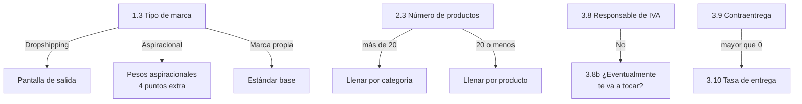

# Formulario de onboarding · Pantalla por pantalla

El cliente abre un link, responde una pregunta por pantalla como si fuera un quiz, y al terminar sale con su cuenta del portal creada. Esto es el guion exacto: qué dice cada pantalla, qué se guarda y qué calcula el portal solo.

## Cómo se siente

Una pregunta por pantalla. No un formulario largo con treinta cajas: una pregunta grande en el centro, su instrucción debajo, un botón. Enter avanza. Se llena desde el celular, caminando, en unos veinte minutos.

**El tono es de conversación, no de trámite.** El portal saluda por el nombre y usa lo que el cliente ya respondió: si dijo que la marca se llama Peluna, la pantalla siguiente pregunta "¿Qué vende Peluna?", no "Nombre del producto".

**Barra de progreso arriba, siempre.** Seis bloques. El cliente ve en cuál va y cuántos le faltan. Entre bloque y bloque va una pantalla de respiro que dice qué viene y para qué se pregunta.

**Al cerrar cada bloque se le devuelve algo.** Eso es lo que lo hace un quiz y no un trámite: apenas termina el bloque de números, la pantalla le dice "con esos números tu CPA máximo es $47.000 — hoy estás pagando $61.000". No se le explica todavía, pero ya sintió que el formulario le sirve a él, no solo a nosotros.

**Guarda en cada respuesta.** Si cierra el navegador en la pregunta 14, el link lo devuelve a la 14. Nadie llena veintisiete campos de una sentada en el celular.

**Cada pregunta trae su instrucción debajo.** Dónde se ve el dato, en qué pantalla, cómo se calcula si no lo tiene a la mano. Esa es la regla que permite exigirlo completo: si no lo llenó, no fue porque no supiera dónde buscar.

**Nada se pregunta dos veces y nada que el portal pueda calcular se pregunta.** Al cliente solo se le piden datos crudos.

## El mapa

Seis bloques, 30 campos, unas 35 pantallas contando las de respiro. El orden no es arbitrario: lo fácil primero, los números en el medio cuando ya está metido, y el acceso al final cuando ya invirtió tiempo y no lo va a abandonar.

| Bloque | Qué pregunta | Pantallas | Alimenta |
| --- | --- | --- | --- |
| 1 | Tu marca | 5 | Perfil, D6, D7 |
| 2 | Tus productos | 5 a 7 | D1 datos de base, D2 |
| 3 | Tus números | 11 | D2, D5 |
| 4 | Tu web | 2 | 6.1 y 6.2 |
| 5 | Tus clientes | 2 | 8.2 y 8.3 |
| 6 | Tu equipo | 1 repetible | 9.1, 9.2, 9.4 |
| — | Tu acceso al portal | 2 | La cuenta |

La cuenta publicitaria no es un campo. Deison la gestiona aparte, directo con el cliente.

**La primera pregunta del bloque 1 es la más importante de todo el formulario** — qué tipo de marca es — porque de ahí sale qué se le pregunta después y cómo se pesa todo lo que responda.

## Bloque 1 · Tu marca

| Pantalla | Lo que dice | Campo | La instrucción debajo |
| --- | --- | --- | --- |
| 1.0 | **Bienvenido a Inforce** 🦾 — Veinte minutos ahora y llegamos a tus llamadas con tu caso ya estudiado. Cada pregunta te dice dónde sacar el dato. Puedes parar y seguir cuando quieras. | Botón "Arrancar" | — |
| 1.1 | Primero lo primero: ¿cómo te llamas? | Texto corto | — |
| 1.2 | Un gusto, [Nombre]. ¿Cómo se llama tu marca? | Texto corto | — |
| 1.3 | ¿Qué es [Marca]? — *Marca propia que resuelve un problema* · *Marca aspiracional: ropa, accesorios, joyería, calzado* · *Dropshipping* | Una de tres, en tarjetas grandes | Si tu cliente compra porque le soluciona algo, es la primera. Si compra porque le gusta cómo se ve o cómo lo hace ver, es la segunda. |
| 1.4 | ¿Cuál es la página de [Marca]? | URL | Pégala completa, con https. Si tienes varias, la que reciben los anuncios. |
| 1.5 | ¿Y el Instagram? | @usuario | Solo el arroba. Si manejan varias cuentas, la principal. |
| 1.6 | ¿Quiénes son los dueños de [Marca]? — nombre, correo y teléfono, con botón "Agregar otro socio" | Bloque repetible | Incluíte tú. Pedimos el correo de cada uno porque de ahí salen los accesos al portal. |

**La 1.3 es la bisagra de todo el formulario.** Una marca aspiracional no ve las mismas preguntas ni se pesa igual: la escala de conciencia se lee distinta, el 1.9 no aplica y entran los cuatro puntos aspiracionales. Por eso va antes que cualquier pregunta que dependa de ella, y por eso solo la anteceden el nombre de la persona y el de la marca, que no ramifican nada.

Un dropshipper que marque la tercera opción ve una pantalla que le dice que su estándar es otro y que lo contactamos aparte. No sigue llenando esto.

## Bloque 2 · Tus productos

Pantalla de respiro antes de entrar: *"Ahora hablemos de lo que vendes. Esto es lo que define contra qué se mide tu contenido después."*

| Pantalla | Lo que dice | Campo | La instrucción debajo |
| --- | --- | --- | --- |
| 2.1 | ¿Manejas categorías de producto distintas? | Sí / No | Categoría = un grupo de productos que resuelve una cosa distinta. Ejemplo: una marca de mascotas que vende shampoo, acondicionador y jabón, y además collares y juguetes, maneja dos categorías. Tres sabores del mismo shampoo son una sola. |
| 2.2 | ¿Cuántas categorías? | Número | Con el ejemplo de arriba serían 2: cuidado y accesorios. Cuenta grupos, no productos. |
| 2.3 | ¿Cuántos productos vendes en total? | Número | Cuenta referencias, no unidades. Si el shampoo viene en tres tamaños, son tres referencias. |
| 2.4 | Tus tres productos principales | Nombre + precio de venta, tres filas | Los tres que más facturan hoy, no los que más te gustan. El precio con el que salen en la web, con IVA si lo cobras. |
| 2.5 | ¿Cuánto te queda de cada uno? | Margen en pesos o en %, por producto, con casilla "no lo sé" | Es el precio de venta menos todo lo que te cuesta poner ese producto en la mano del cliente: producto, empaque, envío y pasarela o comisión de contraentrega. No restes pauta ni sueldos. |
| 2.6 | *(rama)* Como tienes más de 20 productos, llénalo por categoría | Categoría + ticket promedio + margen, una fila por categoría | Ticket promedio de la categoría = lo que facturó esa categoría el mes pasado dividido entre el número de pedidos de esa categoría. |
| 2.7 | Con lo que pusiste, de cada venta te queda como el 34%. ¿Es más o menos así? | Confirmar / corregir el % | El portal lo saca promediando lo que pusiste arriba, pero tú conoces tu mezcla mejor que un promedio. Si vendes mucho más de un producto que de los otros, corrígelo aquí. |

**La rama de la 2.6** se dispara sola cuando en la 2.3 el cliente puso más de 20 productos. En ese caso la 2.4 y la 2.5 se saltan: pedirle precio y margen de cuarenta referencias es garantía de que abandona el formulario.

**El margen es el único campo de este bloque que trae casilla de "no lo sé",** y si la marca es aspiracional la instrucción cambia una línea: ahí el costo de producción de la prenda suele estar claro pero el de devoluciones no, y la devolución es parte del costo.

## Bloque 3 · Tus números

Pantalla de respiro: *"Esta es la parte que más cuesta y la que más sirve. Cada pregunta te dice exactamente dónde sacar el dato. Al final te devuelvo tus números calculados."*

| Pantalla | Lo que dice | Campo | La instrucción debajo |
| --- | --- | --- | --- |
| 3.1 | ¿Cuánto facturó [Marca] el mes pasado? | Pesos | En Shopify: **Analytics → Reportes → Ventas totales**, con el rango en el mes pasado completo. Si vendes contraentrega, usa el reporte de pedidos **entregados**, no de pedidos creados. |
| 3.2 | ¿Y el promedio de los últimos tres meses? | Pesos | El mismo reporte con el rango en 90 días, dividido entre 3. Sirve para saber si el mes pasado fue normal o fue un pico. |
| 3.3 | ¿Cuánto quieres estar facturando dentro de tres meses? | Pesos | No es el sueño de fin de año: es lo que quieres facturar en el mes de [mes + 3]. Pónlo serio, porque contra este número se mide todo lo demás. |
| 3.4 | ¿Cuál es tu ticket promedio? | Pesos | Lo que gasta en promedio alguien que te compra. En Shopify: **Analytics → Valor promedio de pedido**. Si no lo tienes: la facturación del mes pasado dividida entre el número de pedidos de ese mes. |
| 3.5 | ¿Cuánto invertiste en pauta en los últimos 30 días? | Pesos | Administrador de anuncios de Meta → rango "Últimos 30 días" → columna **"Importe gastado"**. Suma TikTok y Google si también pautas ahí, y suma todas tus cuentas publicitarias. |
| 3.6 | ¿Cuánto te cuesta conseguir una venta? | Pesos, obligatorio, con botón **Calcúlalo por mí** | Administrador de anuncios → columna **"Costo por resultado"**, con el resultado puesto en Compras. Si no te aparece, dale a Calcúlalo por mí y solo pon cuántas compras hiciste en esos 30 días. |
| 3.7 | ¿Cuál es tu ROAS? | Número, obligatorio, con botón **Calcúlalo por mí** | Administrador de anuncios → columna **"ROAS de compras"**. Si no te aparece, dale a Calcúlalo por mí y pon cuánto facturó la pauta en esos 30 días. Un ROAS de 3 quiere decir que por cada peso invertido entran tres. |
| 3.8 | ¿Eres responsable de IVA? — *Sí, soy responsable* · *No soy responsable* | Una de dos | Dinos la verdad tranquilo: esto no sale de aquí y no tiene nada que ver con la DIAN. Lo preguntamos porque el IVA sale de tu margen, y si no lo sabemos te calculamos un CPA máximo más alto del que de verdad puedes pagar. |
| 3.8b | *(si respondió que no)* ¿Y eventualmente vas a tener que empezar a cobrarlo? | Sí / No | Si vas camino a pasarte del tope, conviene que el plan lo tenga en cuenta desde ahora y no cuando ya te tocó. |
| 3.9 | De cada 100 pedidos, ¿cuántos son contraentrega y cuántos pagados por adelantado? | Dos números que suman 100, en un slider | Contraentrega = el cliente paga cuando recibe. Anticipado = pagó en la web con tarjeta, PSE o Nequi. Si no estás seguro, míralo en tu transportadora o en tu pasarela. |
| 3.10 | *(si hay contraentrega)* De cada 100 pedidos que despachas contraentrega, ¿cuántos se entregan de verdad? | % | Te lo da tu transportadora: pedidos entregados sobre pedidos despachados, del mes pasado. Es el número que más cambia tu margen real y casi nadie lo tiene presente. |
| 3.11 | Después de pagar la pauta, ¿qué parte de tu margen quieres que te quede? — *20%* · *30%* · *40%* · *otro* | Una de cuatro | Esto lo decides tú, no nosotros. De ahí sale tu CPA objetivo: el máximo que puedes pagar por una venta para que te quede lo que quieres. Entre más quieras que te quede, más barato tiene que salirte vender. |

**Pantalla de cierre del bloque — la recompensa.** Con lo que acaba de responder, el portal le devuelve tres números sin explicarlos todavía: su CPA máximo, su ROAS de equilibrio y cuánto tendría que invertir al mes para llegar a la meta de la 3.3. Si su CPA de la 3.6 ya pasó el máximo, la pantalla lo dice en una línea y cierra con "de eso hablamos en la llamada". Un solo botón abajo: **Seguir**.

**El botón "Calcúlalo por mí" reemplaza la casilla de "no lo sé" en el CPA y el ROAS.** No se le acepta a una marca que no sepa lo que paga por una venta, pero tampoco se le tranca el formulario: se le pide el dato crudo que sí tiene a la mano y el portal hace la división. El número de compras y la facturación de la pauta quedan guardados igual, que sirven después.

## Bloque 4 · Tu web

Dos preguntas. Son las únicas de la dimensión 6 que llena el cliente: el resto lo califica José entrando a la web antes de la llamada, como entraría un comprador que viene de un anuncio.

| Pantalla | Lo que dice | Campo | La instrucción debajo |
| --- | --- | --- | --- |
| 4.1 | De cada 100 personas que entran a tu web, ¿cuántas compran? | % con un decimal, con casilla "no lo sé" | En Shopify: **Analytics → Tasa de conversión de la tienda**, rango últimos 30 días. Si no lo tienes: pedidos del mes dividido entre sesiones del mes, por 100. Normal en Colombia es entre 1% y 2,5%. |
| 4.2 | De la gente que le da clic a tus anuncios, ¿qué porcentaje alcanza a ver tu página? | %, con casilla "no lo sé" | Administrador de anuncios → personaliza columnas → agrega **"Visitas a la página de destino"** y **"Clics en el enlace"**. Divide la primera entre la segunda. Eso te dice cuánta gente se cae antes de que cargue tu web. Si te da menos de 80%, estás pagando por gente que nunca vio nada. |

## Bloque 5 · Tus clientes

| Pantalla | Lo que dice | Campo | La instrucción debajo |
| --- | --- | --- | --- |
| 5.1 | ¿Qué porcentaje de tus clientes te vuelve a comprar, y cada cuánto? | % + tiempo, con casilla "no lo sé" | En Shopify: **Analytics → Clientes → Clientes que regresan**, en los últimos 12 meses. El "cada cuánto" es a ojo: al mes, a los tres meses, al año. Si vendes algo que se compra una sola vez en la vida, ponlo así — no es un problema, es información. |
| 5.2 | ¿Tienes la base de datos de tus clientes en un solo lugar y la puedes exportar? | Sí / No | Sí = puedes sacar hoy un archivo con nombre, teléfono, correo y qué compró cada uno. Si está repartida entre Shopify, un Excel y los chats de WhatsApp, la respuesta es No. |

## Bloque 6 · Tu equipo

| Pantalla | Lo que dice | Campo | La instrucción debajo |
| --- | --- | --- | --- |
| 6.1 | ¿Quién trabaja en [Marca] y qué hace cada uno? — nombre + qué hace, con botón "Agregar persona" | Bloque repetible | Ponlos a todos: de planta, por horas, freelance y agencias. Incluíte tú y a tus socios, con lo que hacen de verdad en el día a día, no con el cargo. "Juan — edita los videos y responde WhatsApp" sirve; "Juan — gerente" no sirve. |

De esta sola pantalla salen tres cosas: quién hace qué (9.1), si los roles están claros o todos hacen de todo (9.2), y los huecos de rol (9.4), que el portal calcula solo comparando lo que escribió contra la lista de roles que una marca de su nivel debería tener cubiertos.

## El cierre · Su acceso al portal

Dos pantallas. Aquí es donde el formulario deja de ser un formulario y se vuelve su cuenta.

| Pantalla | Lo que dice | Campo |
| --- | --- | --- |
| C.1 | Listo, [Nombre]. Con esto ya podemos estudiar [Marca] antes de hablar contigo. Solo falta una cosa: tu acceso. — *Tu correo: [el del 1.6, precargado]* — *Crea tu contraseña* | Correo editable + contraseña + confirmación |
| C.2 | Tu cuenta está lista. Aquí va a vivir todo tu proceso con Inforce: tu diagnóstico, tu plan y tus llamadas. — Botón: **Entrar al portal** | — |

**No hay correo de confirmación de por medio.** El cliente crea la contraseña y entra en el mismo momento, con la sesión ya iniciada. Un correo de verificación aquí es un punto de fuga: la mitad no lo abre y la cuenta queda sin activar.

**Los socios que puso en la 1.6 quedan creados como usuarios de la misma marca**, cada uno con su correo y un link para poner su propia contraseña. La cuenta es de la marca, no de una persona.

**Lo primero que ve al entrar** no es un panel vacío: es su perfil de marca ya lleno con lo que acaba de responder, sus números calculados, y un estado que dice que el diagnóstico se completa en las llamadas. Que vea que lo que escribió sirvió para algo.

## Cómo se manda y qué pasa después

El link se genera desde el portal, uno por cliente, y se manda por WhatsApp apenas firma:

```
Hola [Nombre], bienvenido a Inforce 🦾

Antes de tus llamadas de onboarding necesito que llenes este formulario:
es la información base de tu marca y es lo que nos permite llegar a las
llamadas ya habiendo estudiado tu caso.

Cada pregunta trae la instrucción de dónde sacar el dato, así que no te
vas a trancar en ninguna.

Ojo: sin el formulario completo nos toca reagendar las llamadas.

Al final creas tu acceso al portal, donde va a vivir todo tu proceso.

[link]
```

**Es requisito para agendar, no para entrar.** Sin formulario completo no se agenda la primera llamada, y el cliente tiene que saberlo antes de empezar, no después: el mensaje se lo dice, la pantalla 1.0 se lo repite en una línea, y si intenta agendar con el formulario a medias la pantalla de agenda le muestra en qué pregunta quedó y el botón para volver.

**Del lado de Inforce**, cuando un cliente termina: aviso interno con su nombre, sus números ya calculados y una señal si algo salió en rojo desde el formulario — CPA por encima del máximo, margen bajo, tres o más "no lo sé".

**Si lleva más de 48 horas sin terminarlo**, recordatorio automático con el link que lo devuelve a la pregunta donde quedó, no al principio.

## Lo que el portal calcula solo

Ninguno de estos se le pregunta al cliente. Todos salen de lo que ya respondió.

| Qué calcula | Fórmula | Con qué campos |
| --- | --- | --- |
| Margen bruto por venta | precio de venta − costo total por unidad | 2.4 y 2.5 |
| Margen % por producto | margen ÷ precio de venta | 2.4 y 2.5 |
| Margen de la tienda | ticket promedio × el % que el cliente confirmó | 3.4 y 2.7 |
| Margen después de IVA | margen × 0,8403 | 3.8 en Sí |
| **Margen efectivo** | margen × (% contraentrega × tasa de entrega + % anticipado) | 3.9 y 3.10 |
| **CPA máximo** (punto de equilibrio) | = el margen efectivo por venta | encadenado |
| **ROAS de equilibrio** | ticket promedio ÷ margen efectivo | encadenado |
| **CPA objetivo** | CPA máximo × (1 − lo que quiere que le quede) | 3.11 |
| Ventas actuales al mes | facturación del mes ÷ ticket promedio | 3.1 y 3.4 |
| Ventas necesarias para la meta | facturación objetivo ÷ ticket promedio | 3.3 y 3.4 |
| Brecha de ventas | ventas necesarias − ventas actuales | encadenado |
| Inversión necesaria, a su CPA de hoy | ventas necesarias × CPA actual | 3.6 |
| Inversión necesaria, a CPA objetivo | ventas necesarias × CPA objetivo | encadenado |
| Utilidad proyectada en la meta | ventas necesarias × (margen efectivo − CPA) | encadenado |
| **2.1 · Salud del margen** | (CPA máximo − CPA actual) ÷ CPA máximo | 3.6 contra el CPA máximo |
| **2.2 · ¿Conoce sus números?** | cuántas casillas "no lo sé" marcó, de cuatro posibles | 2.5, 4.1, 4.2 y 5.1 |

### Las tres que hay que mirar de cerca

**El 0,8403 del IVA** sale de que lo que se paga es el 19% sobre el valor agregado, no sobre la venta entera: 0,19 ÷ 1,19 = 15,97% del margen. Solo aplica si el cliente respondió que es responsable de IVA. Si respondió que no, el margen se deja como está — y si además dijo en la 3.8b que eventualmente le va a tocar cobrarlo, el diagnóstico muestra las dos versiones: su margen de hoy y el que va a tener cuando entre al régimen.

**El margen efectivo es optimista y hay que saberlo.** La fórmula descuenta lo que no se entrega, pero no descuenta lo que cuesta despachar un pedido que se devolvió: el flete de ida y el de vuelta se pagan igual. Para que sea exacto habría que preguntar el costo del flete, que es un campo más.

**El corte del 2.2 hay que reajustarlo en el Estándar.** Ahí quedó escrito "0 = Sí, 3 o más = No" cuando había seis casillas posibles. Al quitarle la casilla al CPA y al ROAS quedan cuatro. Propuesta: 0 casillas = Sí · 1 o 2 = a medias · 3 o 4 = No.

### El semáforo del 2.1 — qué mide, porque no es el margen

El 2.1 no mide cuánto margen tiene la marca. Mide **cuánto aire le queda entre lo que paga hoy por una venta y lo máximo que podría pagar sin perder plata.**

Un ejemplo con números: vendes un producto de $100.000 y te quedan $30.000 limpios. Tu margen es 30% y tu CPA máximo es $30.000 — ese es el techo, ahí no ganas ni pierdes.

- Si hoy pagas $18.000 por venta, te queda 40% de aire. Verde.
- Si hoy pagas $27.000 por venta, te queda 10% de aire. Rojo.

Es la misma marca, con el mismo margen del 30%, en dos situaciones completamente distintas. Por eso este punto no se puede calificar mirando el margen.

| Aire que le queda | Qué está pasando | Lectura |
| --- | --- | --- |
| 40% o más | Paga menos del 60% de lo que se puede dar. Tiene con qué escalar | Verde |
| 15% a 40% | Le queda aire, pero cualquier subida de CPA lo saca de rentabilidad | Amarillo |
| Menos de 15% | Está pegado al punto de equilibrio. Vende y no gana | Rojo |
| Negativa | Cada venta pierde plata | Rojo profundo — salta la fila del plan en cualquier nivel |

**Y aguanta cualquier tipo de marca porque es un porcentaje, no un monto.** El que vende carros con $5 millones de margen y paga $400.000 por venta tiene 92% de aire: verde. El que vende gomitas con $8.000 de margen y paga $7.000 tiene 12%: rojo. La escala no sabe de tickets, solo de qué tan cerca está cada uno de su propio techo. Donde sí se rompe es con productos de ciclo largo, donde la venta no cae en el mismo mes que la pauta: ahí el CPA del mes miente y toca mirarlo a 60 o 90 días.

## Reglas de construcción

Lo que el programador necesita saber que no se ve en el copy.

**Las ramas.** Solo hay cuatro y todas se resuelven con lo que el cliente ya respondió:



**La casilla "no lo sé" existe solo en cuatro campos:** margen (2.5), tasa de conversión (4.1), porcentaje de carga (4.2) y recompra (5.1). El CPA y el ROAS no la llevan — son obligatorios, y quien no los tenga los saca con el botón "Calcúlalo por mí". En todo lo demás no hay casilla y el campo es obligatorio.

**Cómo se ve la instrucción, que es la mitad del asunto.** Va debajo de la pregunta, en gris, un punto más pequeña, de dos a tres líneas. Nunca más de tres. No es un tooltip ni un signo de interrogación que hay que abrir: está ahí puesta, se lee de una ojeada y no estorba. Cuando la instrucción necesita una ruta de menú, la ruta va en negrilla dentro del gris (**Analytics → Valor promedio de pedido**) para que el ojo la pesque sin leer la frase entera.

**Validaciones que evitan basura en el diagnóstico:**

- Los dos porcentajes de la 3.9 tienen que sumar 100
- El margen de la 2.5 no puede ser mayor que el precio de la 2.4
- Si la facturación objetivo de la 3.3 es menor que la del último mes, se le pregunta si está seguro
- Los montos entran con separador de miles y muestran la cifra en palabras debajo ("$45.000.000 — cuarenta y cinco millones"), porque un cero de más en la facturación daña todos los cálculos
- Un CPA mayor que el ticket promedio no se rechaza, pero se marca para revisar en la llamada

**El guardado** es por respuesta, no por bloque. El link lleva el identificador del cliente y devuelve a la última pregunta sin responder. No hay botón de "guardar".

**Se puede devolver** a cualquier pregunta anterior desde la barra de progreso. Los cálculos se rehacen solos.

**Todo queda en el perfil de la marca con el número del punto del Estándar que alimenta**, no como respuestas sueltas de un formulario. La 2.5 no es "pregunta 9": es el insumo del 2.1, y así tiene que estar guardado para que la pantalla de onboarding lo lea.
