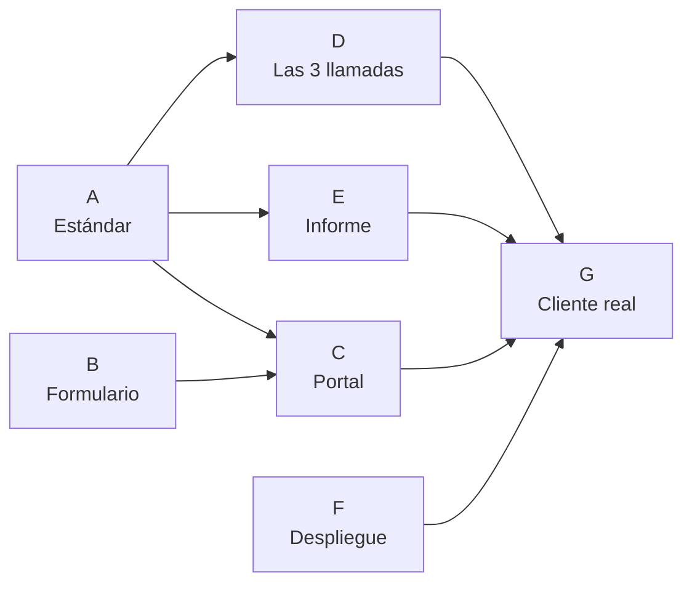

# Onboarding Inforce · Roadmap de construcción

2026-09-20 · @Someone

Todo lo que falta para dejar terminada la parte de onboarding del service delivery: desde que el cliente firma hasta que recibe su informe y su despliegue. El seguimiento y el acompañamiento van aparte.

## Dónde vas hoy

De siete bloques, uno está en curso y seis no han empezado. El estándar va en 3 de 11 dimensiones.

| Bloque | Qué es | Estado |
| --- | --- | --- |
| A | El Estándar de marcas | Terminado. Las diez dimensiones cerradas, anclajes robustecidos, corte por nivel resuelto. Queda repasar la 4 y la 7 con Nath, y la 5 y la 10 con Deison. |
| B | El formulario previo | Listo para construir. El guion completo pantalla por pantalla, con la instrucción de cada campo y las fórmulas, está en su propio documento. Faltan cuatro decisiones tuyas que están marcadas ahí. |
| C | La pantalla de onboarding en el portal | Siguiente. Es lo que vas a construir con Claude Code, en tres piezas seguidas. |
| D | Las tres llamadas | Sin empezar |
| E | El informe nuevo | Sin empezar |
| F | Despliegue creativo y orgánico | Sin empezar |
| G | Prueba con un cliente real | Sin empezar |

El bloque A era el cuello de botella y ya está resuelto: las diez dimensiones están definidas, con sus anclajes, sus pruebas y el corte por nivel. De aquí en adelante todo se construye, no se discute. El camino crítico ahora es la instrucción de cada campo del formulario, que es lo que se necesita para programar la primera pieza del portal.

## Bloque A · El Estándar de marcas

Definir qué tiene una marca que llega a su objetivo, dimensión por dimensión, en puntos que se pueden calificar. Se trabaja con Claude por preguntas: Claude trae el borrador, José corrige.

- [x] Marco: tres niveles, formato de calificación, mapa de las dimensiones
- [x] Dimensión 1 · Producto y oferta
- [x] Dimensión 2 · Números del negocio
- [x] Dimensión 3 · Estrategia creativa
- [x] Dimensión 4 · Producción de contenido
- [x] Dimensión 5 · Tráfico y estructura de campañas
- [x] Dimensión 6 · Web y conversión (CRO)
- [x] Dimensión 7 · Orgánico y marca
- [x] Dimensión 8 · Retención y recompra
- [x] Dimensión 9 · Equipo y sistemas — se fusionaron las dos que eran aparte
- [x] Dimensión 10 · Datos y lectura de resultados
- [ ] Revisar con Nath sus dimensiones (4 y 7)
- [ ] Revisar con Deison sus dimensiones (5 y 10) y el contraste de números de la 2
- [x] Dejar escrita la lista exacta de métricas del punto 5.5
- [x] Pasada de robustecimiento de los anclajes de 10 y de 1, ahora que están las diez completas
- [x] Definir el corte por nivel: qué nota es suficiente en BASE, en ESCALA y en ÉLITE

**Ojo con las de Nath y Deison.** Tú puedes definirlas solo, pero si ellos no participan van a calificar con su propio criterio y el estándar se cae en la práctica. Una sesión de una hora con cada uno alcanza.

## Bloque B · El formulario previo

Lo llena el cliente antes de entrar a cualquier llamada. Evita gastar llamada en datos y permite que tú llegues con hallazgos en vez de con preguntas.

- [x] Listar los campos — están en el Estándar, sección "El formulario previo, campo por campo": 27 campos en siete bloques, más los accesos
- [x] Decidir si es requisito para **agendar** la llamada o solo para entrar a ella
- [x] Definir qué pasa si el cliente llega con el formulario a medias
- [x] Escribir el mensaje con que se le pide al cliente y cómo se le explica para qué es
- [ ] Construirlo — decidir si va en Google Forms provisional o directo en el portal
- [x] Escribir la instrucción de cada uno de los 27 campos: en qué pantalla se saca el dato y cómo se calcula si toca calcularlo. Es lo único que falta del bloque B y es lo que necesitas antes de programarlo.

El guion exacto vive en [Formulario de onboarding · Pantalla por pantalla](project/6e114548-0c2c-46ed-a0b1-ae0b2ee5c4d6): lo que dice cada pantalla, la instrucción de cada campo, las ramas, las validaciones y las fórmulas que el portal calcula solo. Es lo que se le pasa a Claude Code.

**La decisión que más pesa** es la de "requisito para agendar". Si es obligatorio para agendar, se llena siempre pero puede frenar el arranque del cliente. Si es solo para entrar, se te van a colar llamadas con el formulario a medias y vuelves a gastar tiempo preguntando.

## Bloque C · La pantalla de onboarding en el portal

Cada cliente nuevo tiene su portal, y ahí vive el estándar. En la llamada se comparte pantalla y se califica con el cliente delante. Esto lo construyes tú con Claude Code.

Se construye en tres piezas seguidas, en este orden. Cada una necesita la anterior.

### Pieza 1 · El formulario del cliente, con creación de cuenta

- [ ] Un link único por cliente, que se llena igual desde el celular o desde el computador
- [ ] Los 27 campos, cada uno con su instrucción al lado de dónde sacar el dato
- [ ] Guarda a medias y retoma: nadie llena veintisiete campos de una sentada en el celular
- [ ] Al terminar, el cliente crea su contraseña y le queda abierta la cuenta del portal. No hay un segundo paso ni un correo aparte
- [ ] Lo que llenó cae directo al perfil de la marca. Nadie vuelve a transcribir nada
- [ ] La calculadora corre sola apenas entran los números: margen bruto, CPA máximo, ROAS de equilibrio, CPA objetivo, ventas e inversión necesarias para la meta de tres meses
- [ ] Aviso interno cuando un cliente termina, para que sepas que ya se puede agendar

### Pieza 2 · Las plantillas de onboarding, interconectadas

- [ ] Una pantalla por llamada: la tuya, la de Nath, la de Deison. Cada una trae sus dimensiones y nada más
- [ ] Cada punto se ve igual: su calificación (Sí/No, 1 a 10, o descripción), su descripción y su ejemplo al lado
- [ ] Interconexión de verdad: la distribución de conciencia del 1.7 calcula la mezcla TOFU/MOFU/BOFU contra la que se califica 3.5 a 3.7; la sofisticación del 1.8 dice qué tipo de creativo toca; el 2.1 sale del CPA contra el CPA máximo; el 8.1 en No apaga todo el bloque de recompra; el 1.7 en necesidad apaga el 1.9
- [ ] Los puntos condicionales se ocultan solos cuando no aplican, en vez de quedar en blanco
- [ ] La pantalla marca las contradicciones: lo que el cliente dijo en el formulario contra lo que se ve en la llamada
- [ ] Permisos por rol: cada uno edita lo suyo y lee lo de los anteriores
- [ ] La IA llena la descripción de cada punto con el transcript de Fathom al terminar la llamada; el humano corrige, no escribe desde cero

### Pieza 3 · El informe y el diagnóstico completo

- [ ] Lo que ve el cliente cuando entra solo, sin ti al lado
- [ ] Diagnóstico: las diez dimensiones calificadas contra la vara completa, sin descuento por nivel
- [ ] Plan: solo las tres o cuatro cosas que importan ahora, en el orden que manda su nivel, con medición y margen de primeras
- [ ] Cada brecha sale con su ejemplo y su prueba concreta, no con un adjetivo
- [ ] Exportable, porque el cliente lo va a querer mostrar adentro de su empresa

### Después, cuando las tres estén de pie

- [ ] Conectar el portal con la biblioteca de anuncios de Facebook, para leer lo que corre en la cuenta del cliente y en las de sus referentes

**Esta es la pieza que convierte el estándar en producto.** Sin ella el estándar es un documento que alguien tiene que transcribir a mano después de cada llamada — que es exactamente el problema que tienes hoy.

## La base de conocimiento del portal

Atraviesa las tres piezas. El Estándar no es solo la hoja donde se califica: es el archivo que la IA lee para poder decir algo útil. Sin esto, el diagnóstico devuelve "tu estrategia creativa está en 5" y el cliente queda igual de perdido que antes.

Lo que tiene que estar cargado antes de que el portal genere un solo diagnóstico:

- [ ] Los anclajes completos de los diez bloques: qué es bueno, qué es malo y la prueba concreta de cada punto
- [ ] El ejemplo de cada punto, que es lo que le da al cliente una imagen de qué se espera de él
- [ ] Las dos escalas de Schwartz: los cinco niveles de conciencia y los cinco de sofisticación, con qué tipo de creativo pide cada uno
- [ ] La lectura de necesidad contra aspiracional, y qué puntos cambian de peso o se apagan en cada caso
- [ ] Los cinco ejes de iteración de un ganador: gancho, formato, creador, edición, concepto
- [ ] La tabla de métricas con sus umbrales y fórmulas, con la advertencia de que el umbral es referencia y no regla, y de que la métrica dice dónde se pierde la gente, no de quién es la culpa
- [ ] El reparto 60/30/10 del presupuesto creativo
- [ ] Los rangos de recompra y el corte de qué marca es apta y cuál no
- [ ] La tabla de prioridades por nivel: qué entra primero en BASE, en ESCALA y en ÉLITE, más las dos reglas que van encima (medición y margen primero; una dimensión en rojo profundo que está tapando todo se salta la fila)
- [ ] Los diagnósticos cruzados y las contradicciones que la pantalla debe marcar sola

**La prueba de que quedó bien hecha:** que el diagnóstico de una marca que sacó 4 en la 3 no diga "mejorar la estrategia creativa", sino "estás haciendo puro BOFU y el 70% de tu mercado no sabe que tu producto existe; con tu nivel de sofisticación en 3 te toca dejar de repetir el claim y empezar a mostrar mecanismo".

## Bloque D · Las tres llamadas

Hoy ninguna tiene estructura. Con el estándar listo, estructurarlas es casi automático: cada llamada es "llenar estas dimensiones".

- [ ] Tu llamada: qué dimensiones cubre, en qué orden, cuánto dura, y qué valor entregas en vivo además de preguntar
- [ ] La llamada de Nath: producción de contenido + orgánico y marca. Hoy no existe, hay que escribirla entera
- [ ] La llamada de Deison: tráfico + datos y lectura de resultados, y contrastar los números del formulario contra la cuenta
- [ ] El handoff: qué lee cada uno antes de entrar a su llamada. Con el portal esto se resuelve solo, pero hay que dejarlo escrito como regla
- [ ] Sacar de tu llamada lo que no necesita llamada: CRO y retención se pueden auditar antes, mirando la web
- [ ] Grabar el pregrabado que reemplace lo que hoy explicas en vivo: el Content Pipeline

**Tu llamada carga siete dimensiones de once.** Si no sacas algunas a auditoría previa, se vuelve una llamada muy larga — y es justo la que dijiste que quieres poder soltar.

## Bloque E · El informe nuevo

Reemplaza al plan de implementación actual. Hoy es el resumen de tres llamadas y unos accionables; la gente lo abre una vez. La lógica nueva es: esto tiene una marca que llega a donde vos querés llegar → esto tenés vos → estas son tus brechas en orden de impacto.

- [ ] Definir la estructura del informe sección por sección
- [ ] Definir cómo se priorizan las brechas: qué va primero en el plan y con qué criterio
- [ ] Decidir qué tan corto es el plan de acción dentro del informe — dijiste que debe ser solo los puntos de mayor impacto, con mini descripción, no un paso a paso
- [ ] Diseñarlo con la estética de Inforce
- [ ] Automatizar que se genere solo desde el perfil lleno en el portal
- [ ] Decidir si el informe es un documento que se lee una vez o una pantalla viva que se revisa en los seguimientos

**Esa última decisión es la importante.** El problema que tú mismo detectaste — que nadie vuelve a abrir el plan — no se arregla con un documento más bonito. Se arregla si el informe es la agenda de las llamadas semanales.

## Bloque F · Despliegue creativo y orgánico

El despliegue creativo ya es tu entregable más fuerte. Aquí se mejora y se le suma el lado orgánico, que hoy no existe.

- [ ] Personalizar más los ejemplos del despliegue creativo para cada marca
- [ ] Crear el despliegue orgánico: qué contenido orgánico en TOFU, MOFU y BOFU
- [ ] Definir la llamada de entrega: qué se entrega, qué se explica en vivo y qué se va a pregrabado
- [ ] Dejar la primera semana de estrategia creativa ya planeada en esa llamada, no solo el marco

**Lo de dejar la primera semana planeada vale mucho.** Es la diferencia entre entregar un documento y que la empresa salga de la llamada sabiendo qué va a grabar el lunes.

## Bloque G · Prueba con un cliente real

- [ ] Elegir el cliente de prueba — candidatos: Nutriplus, Kabboa o Splicito
- [ ] Correrle el onboarding nuevo completo: formulario, tres llamadas con pantalla compartida, informe, despliegue
- [ ] Anotar todo lo que se rompa o se sienta raro durante el proceso
- [ ] Ajustar el estándar, las llamadas y el informe con lo que salga
- [ ] Recoger la reacción del cliente: ¿sintió que le aportó más que antes?

Un solo cliente alcanza para la primera pasada. No esperes a tener todo perfecto: el primero siempre destapa cosas que no se ven en el papel.

## Orden sugerido y dependencias

El estándar bloquea a casi todo. El formulario y el despliegue son los únicos que corren en paralelo sin depender de nada.

**Orden que yo seguiría:**

1. **La instrucción de los 27 campos** — dónde se saca cada dato y cómo se calcula. Es corto y es lo que te falta para poder programar.
2. **El formulario con creación de cuenta** — la pieza 1 del portal. Se puede construir ya, sin esperar nada más.
3. **Cargar la base de conocimiento** — el Estándar completo adentro del portal. Va en paralelo con la pieza 2, porque es lo que la IA va a leer.
4. **Las plantillas de onboarding interconectadas** — la pieza 2. Aquí viven las tres llamadas: el guión de cada una es su pantalla, no un documento aparte.
5. **El informe y el diagnóstico** — la pieza 3. Se diseña sobre un estándar ya lleno de verdad, no imaginado.
6. **Despliegue orgánico y llamada de entrega.**
7. **Correrlo con un cliente real.**

En paralelo a todo esto, sin bloquear nada: repasar la 4 y la 7 con Nath, y la 5 y la 10 con Deison.

**El error caro** sería arrancar por el portal. Si construyes la pantalla antes de tener las once dimensiones cerradas, la vas a rehacer.

## Qué NO entra aquí

Esto es solo el onboarding. Queda por fuera, para después:

- **El acompañamiento y los seguimientos** — la llamada semanal de una hora con Nath y Deison, el chat diario, el informe diario de Deison, tu llamada grupal.
- **El control de cumplimiento del equipo** — que el incumplimiento se vea el mismo día. Este no depende del estándar y lo puedes montar cuando quieras.
- **El Radar de referentes** del portal.
- **Los módulos pregrabados nuevos** — CRO, redes y marca, estrategia creativa, edición, sistemas regrabado. Salen del estándar: cada dimensión débil pide su módulo, así que conviene hacerlos después y no antes.
- **La versión del estándar para dropshippers.**
- **La reunión de resultados y el playbook de renovación.**
